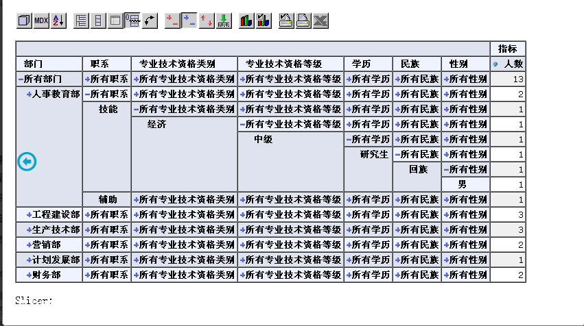

## OLAP 简介
OLAP（On-Line Analysis Processing）在线分析处理是一种共享多维信息的快速分析技术；OLAP利用多维数据库技术使用户从不同角度观察数据；OLAP用于支持复杂的分析操作，侧重于对管理人员的决策支持，可以满足分析人员快速、灵活地进行大数据复量的复杂查询的要求，并且以一种直观、易懂的形式呈现查询结果，辅助决策。

## OLAP的基本概念
#### 变量（度量）
变量是数据度量的指标，是数据的实际意义，即描述数据“是什么”。像上面示例中的人数。

#### 维度
维度是描述与业务主题相关的一组属性，单个属性或属性集合可以构成一个维。如上面示例中的学历、民族、性别等都是维度。

#### 维的层次
一个维往往可以具有多个层次，例如时间维度分为年、季度、月和日等层次，地区维可以是国家、地区、省、市等层次。这里的层次表示数据细化程度，对应概念分层。后面介绍的上钻操作就是由低层概念映射到高层概念。概念分层可除根据概念的全序和偏序关系确定外，还可以通过对数据进行离散化和分组实现。

#### 维的成员
若维是多层次的，则不同的层次的取值构成一个维成员。部分维层次同样可以构成维成员，例如“某年某季度”、“某季某月”等都可以是时间维的成员。

#### 多维数组
多维数组用维和度量的组合表示。一个多维数组可以表示为（维1，维2，……，维n，变量），例如（部门，职系、民族、性别，人数）组成一个多维数组。

#### 数据单元（单元格）
多维数组的取值。当多维数组中每个维都有确定的取值时，就唯一确定一个变量的值。数据单元可以表示为（维1成员，维2成员，……，维N成员，变量的值），例如（人事教育部，技能，回族，男，1人）表示一个数据单元，表示人事教育部职系是技能的回族男性有1人。

#### 事实
事实是不同维度在某一取值下的度量，例如上述人事教育部职系是技能的回族男性有1人就表示在部门、职系、民族、性别四个维度上企业人数的事实度量，并且在为人数事实中包含部门维度人事教育部这一个维度层次，如果将人数事实的所有维度考虑在内，就构成有关人数的多维分析立方体。

## OLAP的特点
电子数据表与OLAP相比，不具备OLAP的多维性、层次、维度计算以及结构与视图分离等特点。

快速。终端用户对于系统的快速响应有很高的要求。调查表明如果用户在30秒内得不到回应，就会变得不耐烦。因此OLAP平台彩用了多种技术提高响应速度，例如专门的数据存储格式、大量的预处理和特殊的硬件设计等，通过减小在线分析处理的动态计算，事先存储OLAP所需粒度的数据等主要手段来获得OLAP响应速度的提高，尽管如此，查询反应慢仍然是OLAP产品中经常被提及的问题。

可分析。用户可以应用OLAP平台分析数据，也可以使用其他外部分析工具，例如电子数据表，这些分析工具基本上都以直观的方式为用户提供了分析功能。

共享。由于人们认为OLAP是只读的，仅需要简单的安全管理，导致目前许多OLAP产品在安全共享方面还存在许多问题。因此当多个用户访问OLAP服务器时，系统就在适当的粒度上加锁。

多维。维是OLAP的核心概念，多维性是OLAP的关键属性，这与数据仓库的多维数据组织正好相互补充。为了使用户能够从多个维度、多个数据粒度查看数据，了解数据蕴含的信息，系统需要提供对数据的多维分析功能，包括切片、旋转和钻取等多种操作

## OLAP的操作
OLAP比较常用的操作包括对多维数据的切片与切块、上钻（drill-up）与下钻（drill-down）以下旋转（rotate）等。此外，OLAP还能对多维数据进行深加工。OALP的这些操作使用户能够从多个视角观察数据，并以图形、报表等多种形式展示，从而获取隐藏在数据中的信息。

#### 切片与切块。
选定多维数组的一个维成员做数据分割的操作称为该维上的一个切片。通常把多维数组中选定一个二维子集的操作视为切片，假设选定的维i上的某个维成员Vi，则此多维数组子集可以定义为（维V1……，维Vi，维N,变量）。当某维只取一个维成员时，便得到一个切片，而切块则是某一维取值范围下的多个切片的叠合。通过对数据立方体的切片或切块分割，可以从不同的视角得到各种数据。

#### 钻取
钻取包括上钻和下钻。争取能够帮助用户获得更多的细节性数据，逐层的分析问题的所在和原因。

上钻又称为上卷（roll-up）。上钻操作是指通过一个维的概念分层向上攀升或者通过维归约在数据立方体上进行数据汇总。例如在上面的示例中，可以按学历汇总数据，如把各种学历的都归约为所有学历，便可以得到沿学历维上钻的数据汇总。
下钻是上钻的逆操作，通过对某一汇总数据进行维层次的细分（沿维的概念分层向下）分析数据。下钻使用用户对数据能够获得更深入的了解，更容易发现问题本质，从而做出正确的决策。
钻取使用户不会再被海量的数据搞得晕头转向：上钻让用户站在更高层次观察数据，下钻则可以细化到用户所判决的详细数据。钻取的尝试与维度与维所划分的层次相对应，根据用户关心的数据粒度合理划分。

#### 旋转
旋转又称转轴，是一种视图操作，通过旋转变换一个报告或页面显示的维度方向，在表格中重新安排维的位置，例如行列转换。这种对立方体的重定位可以得到不同视角的信息。

#### 其他OLAP操作
除以上常用多维操作外，还有其他多维操作。

钻过（drill-across）。钻过操作涉及多个事实表的查询并把结果合并为单个数据集，一个典型的例子就是预测数据与当前数据的结合：通常预测数据与当前数据存在于不同的表中，当用户比较预测销售与当月销售时，需要跨多个事实表查询。
钻透（drill-through）。钻透使用关系SQL,查询数据立方体的底层，一直到后羰的关系表。

## OLAP分类

#### 按处理方式分类

Server OLAP:绝大多数的OLAP系统都属于此类，Server OLAP在服务端的数据库上建立多维数据立方体，由服务端提供多维分析，并把最终结果呈现给用户

Client OLAP：所相关立方体数据下载一本地，由本地为用户提供多维分析，从而保证在网络故障时仍然能正常工作。

#### 按存储方式分类

ROLAP。ROLAP使用关系数据库或扩充关系数据库（XRDBMS）存储管理数据仓库，以关系表存储多维数据，有较强的可伸缩性。其中维数据存储在维表中，而事实数据和维ID则存储在事实表中，维表和事实表通过主外键关联。

MOLAP。MOLAP支持数据的多维视图，采用多维数据组存储数据，它把维映射到多维数组的下标或下标的范围，而事实数据存储在数组单元中，从而实现了多维视图到数组的映射，形成了立方体的结构。大容量的数据使立方体稀疏化，此时需要稀疏矩阵压缩技术处理，由于MOLAP是从物理上实现，故又称为物理OLAP（Physical OLAP）。

DOLAP。DOLAP是属于单层架构，它是基于桌面的客户端OLAP，主要特点是由服务器生成请求数据相关的立方体并下载到本地，由本地提供数据结构与报表格式重组，为用户提供多维分析，此时无需任何的网络连接，灵活的存储方式方便了移动用户的需求，但支持数据有限，使用范围有限。