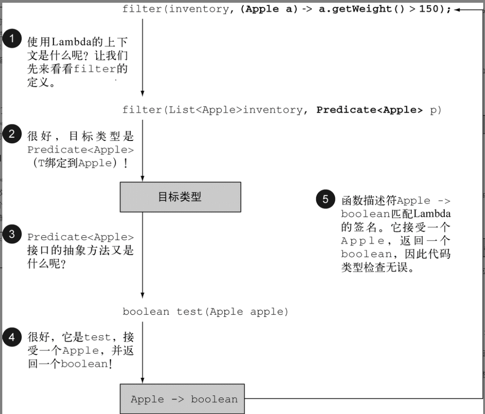

## 行为参数化
行为参数化，就是一个方法接受多个不同的行为作为参数，并在内部使用它们，完成不同行为的能力。

类似策略模式。或者用匿名内部类。本质上是一个接口的匿名实现写法。算语法糖。简化代码量，看上去更简洁些。   

### lambda 表达式
> 等同于新建一个匿名内部类对象。所以原则上必须要能推断出用哪个接口方法才能用表达式。
> 编程思路上等同于把传递方法。而非类和对象。

单表达式
```
(parameters) -> expression
```

或者多语句
```
(parameters) -> {
    statements1;
    statements2;
 }

```


### 函数式接口
使用 `@FunctionalInterface`对接口标识为函数式方法。

在函数式接口上使用Lambda表达式。
函数式接口就是只定义一个抽象方法的接口。是lambda表达式等价的匿名内部类的受体。

类型推断，通过参数和返回值判断lambda表达式是否合法。



### 常用函数式接口 `java.util.Function`
匹配自动拆装箱。

#### `Predicate`

java.util.function.Predicate<T>接口定义了一个名叫test的抽象方法，它接受泛型T对象，并返回一个boolean。


#### `Consumer`

java.util.function.Consumer<T>定义了一个名叫accept的抽象方法，它接受泛型T的对象，没有返回（void）。

#### `Function`
java.util.function.Function<T, R>接口定义了一个叫作apply的方法，它接受一个泛型T的对象，并返回一个泛型R的对象。

### lambda表达式语法糖---方法引用

方法引用主要有三类。

(1) 指向静态方法的方法引用（例如Integer的parseInt方法，写作Integer::parseInt）。

(2) 指向任意类型实例方法的方法引用（例如String的length方法，写作String::length）。

(3) 指向现有对象的实例方法的方法引用（假设你有一个局部变量expensiveTransaction用于存放Transaction类型的对象，它支持实例方法getValue，那么你就可以写expensiveTransaction::getValue）。