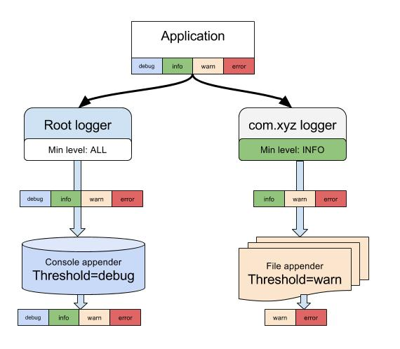

# 日志

### 1. slf4j + log4j

> 参考 <http://blog.csdn.net/anialy/article/details/8529188>

#### 1.1. 引入资源

```xml
<dependency>
    <groupId>org.slf4j</groupId>
    <artifactId>slf4j-log4j12</artifactId>
    <version>1.7.2</version>
</dependency>
```

#### 1.2. 依赖


#### 1.3. 配置文件

```py
#config logger and appender and layout
#设置初始日志级别DEBUG，必填项。
log4j.rootLogger=DEBUG,stdout,file
#console
log4j.appender.stdout=org.apache.log4j.ConsoleAppender
log4j.appender.stdout.Threshold=DEBUG
log4j.appender.stdout.layout=org.apache.log4j.PatternLayout
log4j.appender.stdout.layout.ConversionPattern=%d{yyyy-MM-dd HH:mm:ss} [%p] : %l--> %m%n
#file
log4j.appender.file = org.apache.log4j.FileAppender
log4j.appender.file.File = ${catalina.home}/logs/SPRING-TEST.log
log4j.appender.file.Encoding=UTF-8
#log4j.appender.file.name = fileLogDemo
log4j.appender.file.Threshold=DEBUG
log4j.appender.file.layout=org.apache.log4j.PatternLayout
log4j.appender.file.layout.ConversionPattern=%d{yyyy-MM-dd HH:mm:ss} [%p] : %l--> %m%n
log4j.appender.file.append = false
```

#### 1.4. 调用

```java
import org.slf4j.Logger;
import org.slf4j.LoggerFactory;
public static final Logger logger = LoggerFactory.getLogger(ResultModelParser.class);

logger.info("now {}" , "starting server");
```

#### 1.5. 日志打印过滤图解
