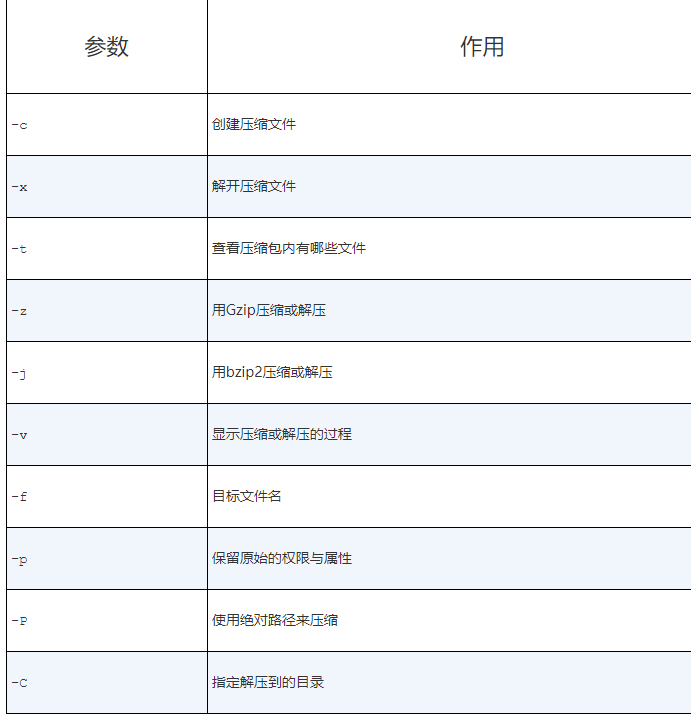
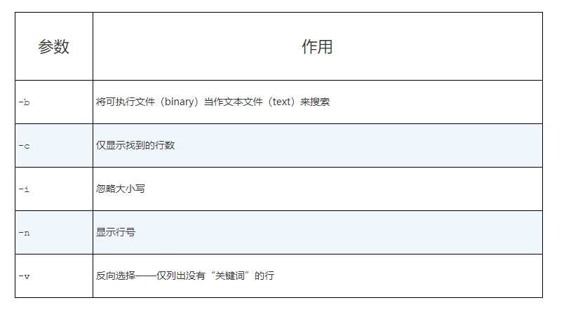
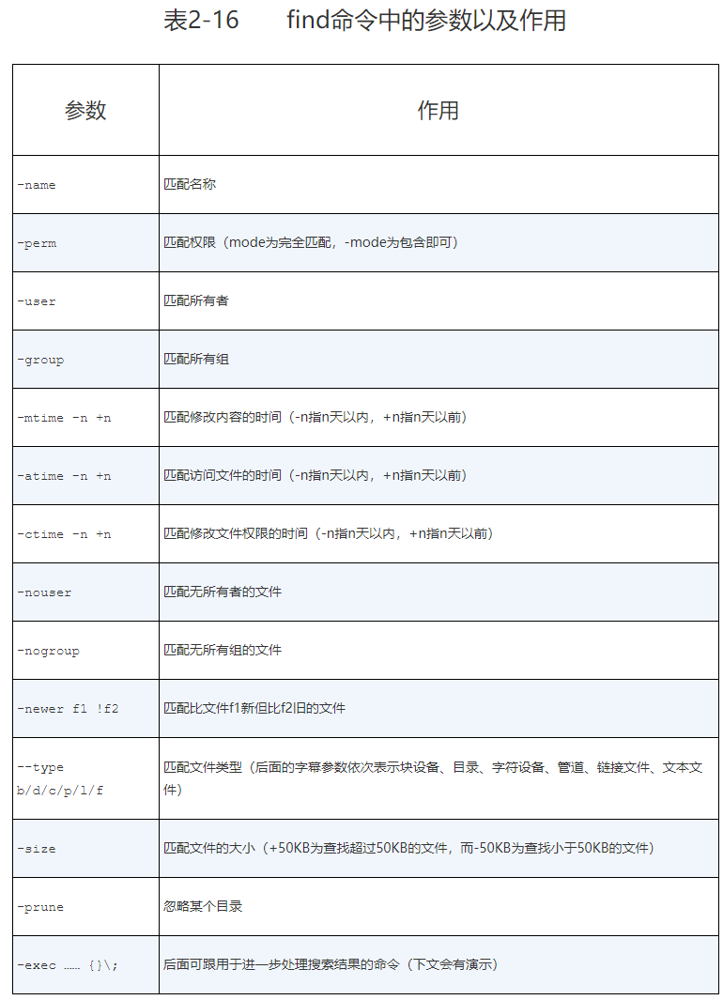
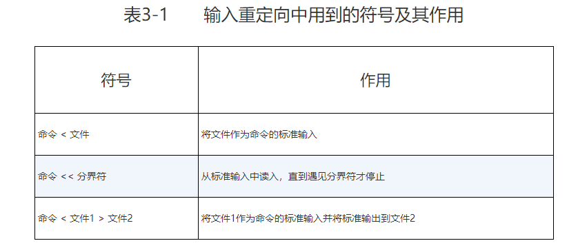
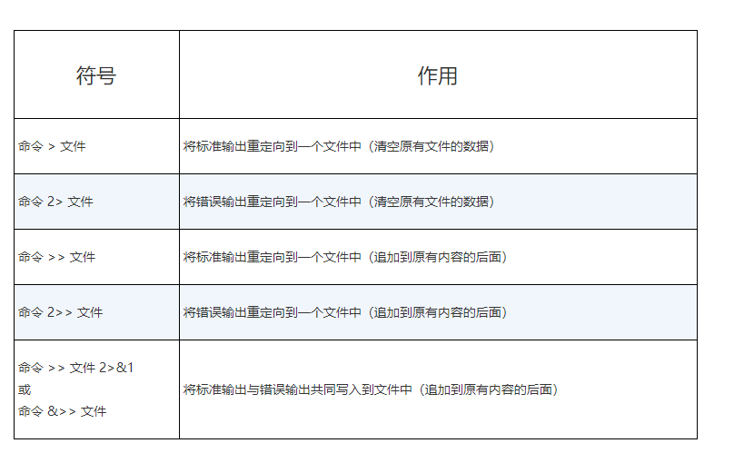
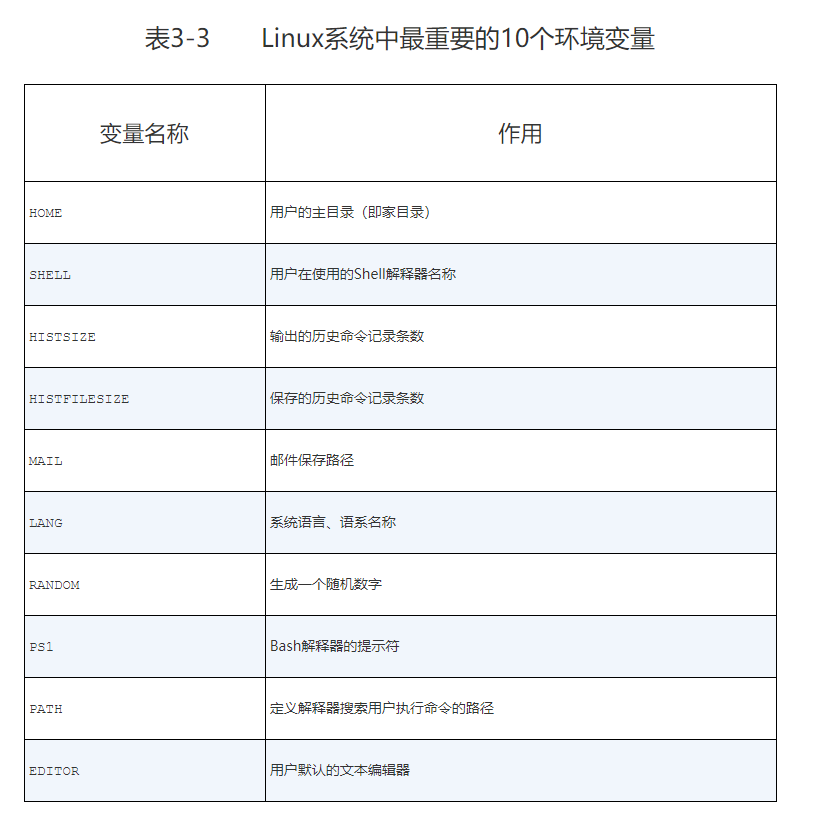

## systemctl命令

```shell
#查看防火墙状态
systemctl status firewalld.service
#关闭防火墙命令
systemctl stop firewalld.service
#开启防火墙
systemctl start firewalld.service
#关闭开机自启动
systemctl disable firewalld.service
#开启开机启动
systemctl enable firewalld.service
```
#### systemctl管理服务的启动、重启、停止、重载、查看状态等常用命令


#### systemctl设置服务开机启动、不启动、查看各级别下服务启动状态等常用命令


## linux常用系统工作命令

### echo
### date
### reboot
### wget
### poweroff
### ps
### whereis
查看命令的绝对路径
```
ps -aux
```
在Linux系统中，有5种常见的进程状态，分别为运行、中断、不可中断、僵死与停止，其各自含义如下所示。

- R（运行）：进程正在运行或在运行队列中等待。
- S（中断）：进程处于休眠中，当某个条件形成后或者接收到信号时，则脱离该　 状态。
- D（不可中断）：进程不响应系统异步信号，即便用kill命令也不能将其中断。
- Z（僵死）：进程已经终止，但进程描述符依然存在, 直到父进程调用wait4()系统函数后将进程释放。
- T（停止）：进程收到停止信号后停止运行。


### top
https://www.cnblogs.com/ggjucheng/archive/2012/01/08/2316399.html

### pidof

### kill

### killall

## linux系统状态检测命令
### ifconfig
使用ifconfig命令来查看本机当前的网卡配置与网络状态等信息时，其实主要查看的就是网卡名称、inet参数后面的IP地址、ether参数后面的网卡物理地址（又称为MAC地址），以及RX、TX的接收数据包与发送数据包的个数及累计流量（即下面加粗的信息内容）


### uname
uname命令用于查看系统内核与系统版本等信息，格式为“uname [-a]”。
在使用uname命令时，一般会固定搭配上-a参数来完整地查看当前系统的内核名称、主机名、内核发行版本、节点名、系统时间、硬件名称、硬件平台、处理器类型以及操作系统名称等信息。

如果要查看当前系统版本的详细信息，则需要查看redhat-release文件。
```
cat /etc/redhat-release
```
### uptime
负载时间

### free
内存监控
```
free -h
```
### who
当前登入主机的用户终端信息

### last
last命令用于查看所有系统的登录记录。可以修改日志。

### history
history命令用于显示历史执行过的命令
执行history命令能显示出当前用户在本地计算机中执行过的最近1000条命令记录。
还可以使用“!编码数字”的方式来重复执行某一次的命令。

### sosreport
sosreport命令用于收集系统配置及架构信息并输出诊断文档，格式为sosreport.

## 工作目录切换命令
```
cd -
cd ~
cd /
pwd
ls
ls -a
ls -al
```

## 文本文件编辑命令
### cat 
cat命令用于查看纯文本文件（内容较少的）
```
cat -n a.md
```
### more
more命令用于查看纯文本文件（内容较多的），格式为“more [选项]文件”。
### head
head命令用于查看纯文本文档的前N行，格式为“head [选项] [文件]”。
```
head -n 20 initial-setup-ks.cfg 
```
### tail
tail命令用于查看纯文本文档的后N行或持续刷新内容，格式为“tail [选项] [文件]”。

```
 tail -f /var/log/messages
 tail -n 20 /var/log/messages
 ```
### tr
tr命令用于替换文本文件中的字符，格式为“tr [原始字符] [目标字符]”。

就可以先使用cat命令读取待处理的文本，然后通过管道符（详见第3章）把这些文本内容传递给tr命令进行替换操作即可。

```
cat anaconda-ks.cfg | tr [a-z] [A-Z]
```

### wc
wc命令用于统计指定文本的行数、字数、字节数，格式为“wc [参数] 文本”。

-l 只显示行数
-w 只显示单词数
-c 只显示字节数

```
wc -lwc grub2.cfg 
```
### stat
stat命令用于查看文件的具体存储信息和时间等信息，格式为“stat 文件名称”。
```
[root@linuxprobe ~]# stat anaconda-ks.cfg
File: ‘anaconda-ks.cfg’
Size: 1213 Blocks: 8 IO Block: 4096 regular file
Device: fd00h/64768d Inode: 68912908 Links: 1
Access: (0600/-rw-------) Uid: ( 0/ root) Gid: ( 0/ root)
Context: system_u:object_r:admin_home_t:s0
Access: 2017-07-14 01:46:18.721255659 -0400
Modify: 2017-05-04 15:44:36.916027026 -0400
Change: 2017-05-04 15:44:36.916027026 -0400
Birth: -
```

### cut
cut命令用于按“列”提取文本字符，格式为“cut [参数] 文本”。

```shell
# -d 代表分隔符，-f 代表显示分割后的第几列
cut -d : -f 1 /etc/passwd
```
### diff

diff命令用于比较多个文本文件的差异，格式为“diff [参数] 文件”。

```shell
diff --brief diff_A.txt diff_B.txt
diff -c diff_A.txt diff_B.txt
```

## 文件目录管理命令
### touch
touch命令用于创建空白文件或设置文件的时间，格式为“touch [选项] [文件]”。
可以修改 读取时间 修改时间 等
```
-d 同时修改atime与mtime
-a 仅修改“读取时间”（atime）
-m 仅修改“修改时间”（mtime）
```
### mkdir
mkdir命令用于创建空白的目录，格式为“mkdir [选项] 目录”。

递归创建文件夹
```
mkdir -p a/b/c/d/e
```

### cp
cp命令用于复制文件或目录，格式为“cp [选项] 源文件 目标文件”。


### mv
mv命令用于剪切文件或将文件重命名，格式为“mv [选项] 源文件 [目标路径|目标文件名]”。

### rm
rm命令用于删除文件或目录，格式为“rm [选项] 文件”。

### dd
dd命令用于按照指定大小和个数的数据块来复制文件或转换文件，格式为“dd [参数]”。

linux 上有个/dev/zero的设备文件，每次在课堂上解释它时都充满哲学理论的色彩。因为这个文件不会占用系统存储空间，但却可以提供无穷无尽的数据，因此可以使用它作为dd命令的输入文件，来生成一个指定大小的文件。

```
dd if=/dev/zero of=560_file count=1 bs=560M

dd if=/dev/cdrom of=RHEL-server-7.0-x86_64-LinuxProbe.Com.iso
```

## file
file命令用于查看文件的类型，格式为“file 文件名”。

## 打包压缩和搜索命令
### tar
tar命令用于对文件进行打包压缩或解压，格式为“tar [选项] [文件]”。


tar -czvf 压缩包名称.tar.gz 要打包的目录 命令把指定的文件进行打包压缩；
相应的解压命令为 tar -xzvf 压缩包名称.tar.gz
```
tar -czvf etc.tar.gz /etc
tar xzvf etc.tar.gz -C /root/etc
```

### grep
grep命令用于在文本中执行关键词搜索，并显示匹配的结果，格式为“grep [选项] [文件]”。


```
grep /sbin/nologin /etc/passwd
```
### find

find命令用于按照指定条件来查找文件，格式为“find [查找路径] 寻找条件 操作”。


```shell
find /etc -name "host*" -print
find / -perm -4000 -print
#配合 -exec使用

find / -user linuxprobe -exec cp -a {} /root/findresults/ \;
```

## 管道符、重定向与环境变量

### 输入输出重定向
标准覆盖输出重定向、标准追加输出重定向、错误覆盖输出重定向、错误追加输出重定向以及输入重定向，让读者通过实验切实理解每个重定向模式的作用，解决输出信息的保存问题。

1. 标准输入重定向（STDIN，文件描述符为0）：默认从键盘输入，也可从其他文件或命令中输入。
2. 标准输出重定向（STDOUT，文件描述符为1）：默认输出到屏幕。
3. 错误输出重定向（STDERR，文件描述符为2）：默认输出到屏幕。


#### 标准输入重定向


输入重定向相对来说有些冷门，在工作中遇到的概率会小一点。输入重定向的作用是把文件直接导入到命令中。

管道符，文件输入命令对象。等。

#### 标准输出重定向


### 管道命令符
其执行格式为“命令A | 命令B | 命令C ...”。命令符的作用也可以用一句话来概括“把前一个命令原本要输出到屏幕的数据当作是后一个命令的标准输入”。如：
```
grep "/sbin/nologin" /etc/passwd | wc -l
ls -l /etc/ | more
```
### 命令行的通配符
“百闻不如一见，看书不如实验”

 与正则表达式类似吧。比如星号（*）代表匹配零个或多个字符，问号（?）代表匹配单个字符，中括号内加上数字[0-9]代表匹配0～9之间的单个数字的字符，而中括号内加上字母[abc]则是代表匹配a、b、c三个字符中的任意一个字符。


### 转义字符

- 反斜杠（\）：使反斜杠后面的一个变量变为单纯的字符串。
- 单引号（''）：转义其中所有的变量为单纯的字符串。
- 双引号（""）：保留其中的变量属性，不进行转义处理。
- 反引号（``）：把其中的命令执行后返回结果。

### 环境变量
命令执行过程

第1步：判断用户是否以绝对路径或相对路径的方式输入命令（如/bin/ls），如果是的话则直接执行。

第2步：Linux系统检查用户输入的命令是否为“别名命令”，即用一个自定义的命令名称来替换原本的命令名称。可以用alias命令来创建一个属于自己的命令别名，格式为“alias 别名=命令”。若要取消一个命令别名，则是用unalias命令，格式为“unalias 别名”。我们之前在使用rm命令删除文件时，Linux系统都会要求我们再确认是否执行删除操作，其实这就是Linux系统为了防止用户误删除文件而特意设置的rm别名命令。

第3步：Bash解释器判断用户输入的是内部命令还是外部命令。内部命令是解释器内部的指令，会被直接执行；而用户在绝大部分时间输入的是外部命令，这些命令交由步骤4继续处理。可以使用“type命令名称”来判断用户输入的命令是内部命令还是外部命令。

第4步：系统在多个路径中查找用户输入的命令文件，而定义这些路径的变量叫作PATH，可以简单地把它理解成是“解释器的小助手”，作用是告诉Bash解释器待执行的命令可能存放的位置，然后Bash解释器就会乖乖地在这些位置中逐个查找。PATH是由多个路径值组成的变量，每个路径值之间用冒号间隔，对这些路径的增加和删除操作将影响到Bash解释器对Linux命令的查找。



用户自定义环境变量无法被其他用户使用，可以提升为全局变量。

```
export WORKDIR
```