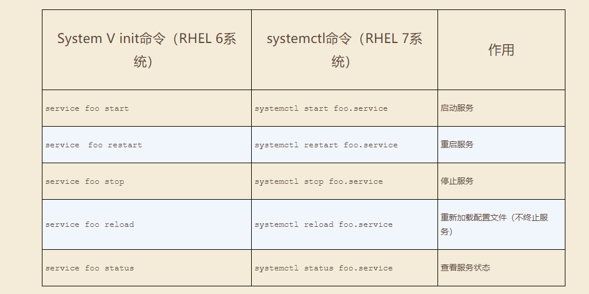
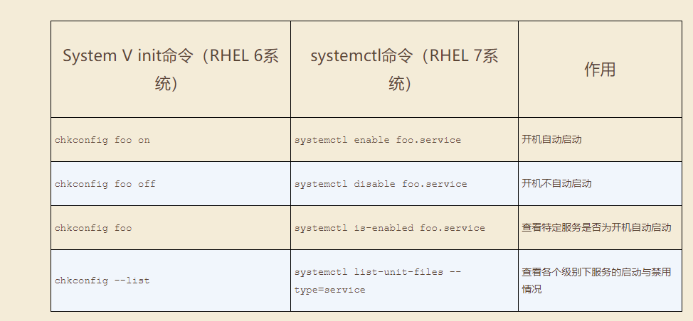
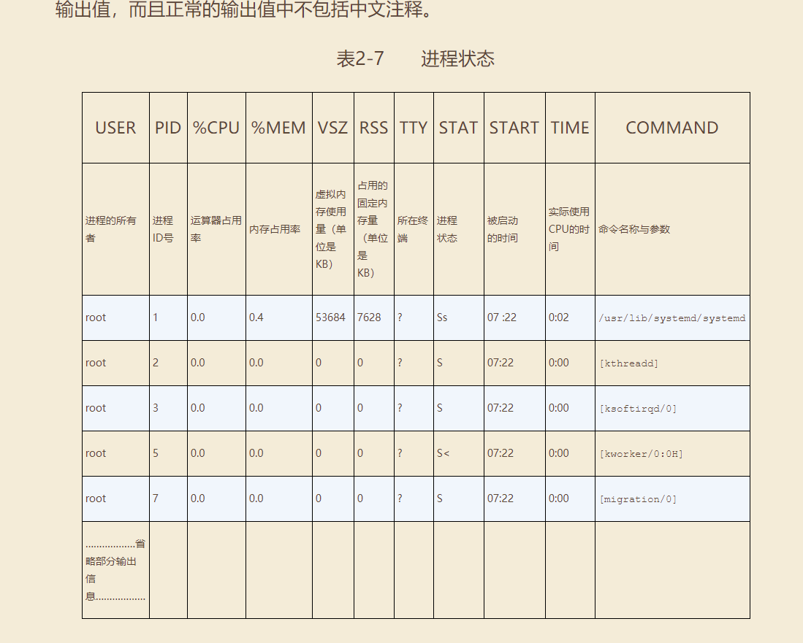
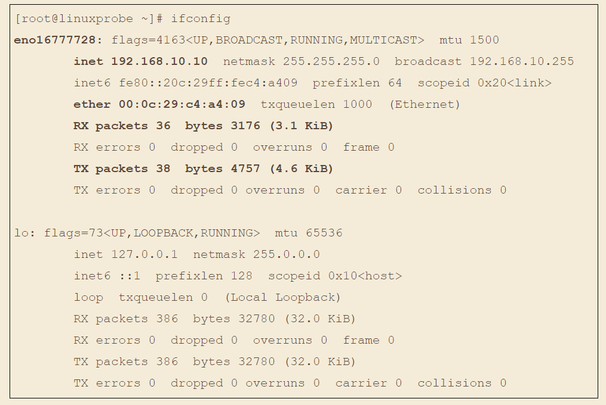

## systemctl命令

```shell
#查看防火墙状态
systemctl status firewalld.service
#关闭防火墙命令
systemctl stop firewalld.service
#开启防火墙
systemctl start firewalld.service
#关闭开机自启动
systemctl disable firewalld.service
#开启开机启动
systemctl enable firewalld.service
```
#### systemctl管理服务的启动、重启、停止、重载、查看状态等常用命令


#### systemctl设置服务开机启动、不启动、查看各级别下服务启动状态等常用命令



## linux常用系统工作命令

### echo
### date
### reboot
### wget
### poweroff
### ps
```
ps -aux
```
在Linux系统中，有5种常见的进程状态，分别为运行、中断、不可中断、僵死与停止，其各自含义如下所示。

- R（运行）：进程正在运行或在运行队列中等待。
- S（中断）：进程处于休眠中，当某个条件形成后或者接收到信号时，则脱离该　 状态。
- D（不可中断）：进程不响应系统异步信号，即便用kill命令也不能将其中断。
- Z（僵死）：进程已经终止，但进程描述符依然存在, 直到父进程调用wait4()系统函数后将进程释放。
- T（停止）：进程收到停止信号后停止运行。



### top
https://www.cnblogs.com/ggjucheng/archive/2012/01/08/2316399.html

### pidof

### kill

### killall

## linux系统状态检测命令
### ifconfig
使用ifconfig命令来查看本机当前的网卡配置与网络状态等信息时，其实主要查看的就是网卡名称、inet参数后面的IP地址、ether参数后面的网卡物理地址（又称为MAC地址），以及RX、TX的接收数据包与发送数据包的个数及累计流量（即下面加粗的信息内容）



### uname
uname命令用于查看系统内核与系统版本等信息，格式为“uname [-a]”。
在使用uname命令时，一般会固定搭配上-a参数来完整地查看当前系统的内核名称、主机名、内核发行版本、节点名、系统时间、硬件名称、硬件平台、处理器类型以及操作系统名称等信息。

如果要查看当前系统版本的详细信息，则需要查看redhat-release文件。
```
cat /etc/redhat-release
```
### uptime
负载时间

### free
内存监控
```
free -h
```
### who
当前登入主机的用户终端信息

### last
last命令用于查看所有系统的登录记录。可以修改日志。

### history
history命令用于显示历史执行过的命令
执行history命令能显示出当前用户在本地计算机中执行过的最近1000条命令记录。
还可以使用“!编码数字”的方式来重复执行某一次的命令。

### sosreport
sosreport命令用于收集系统配置及架构信息并输出诊断文档，格式为sosreport.

## 工作目录切换命令
```
cd -
cd ~
cd /
pwd
ls
ls -a
ls -al
```

## 文本文件编辑命令
### cat 
cat命令用于查看纯文本文件（内容较少的）
```
cat -n a.md
```
### more
more命令用于查看纯文本文件（内容较多的），格式为“more [选项]文件”。
### head
head命令用于查看纯文本文档的前N行，格式为“head [选项] [文件]”。
```
head -n 20 initial-setup-ks.cfg 
```
### tail
tail命令用于查看纯文本文档的后N行或持续刷新内容，格式为“tail [选项] [文件]”。

```
 tail -f /var/log/messages
 tail -n 20 /var/log/messages
 ```
### tr
tr命令用于替换文本文件中的字符，格式为“tr [原始字符] [目标字符]”。

就可以先使用cat命令读取待处理的文本，然后通过管道符（详见第3章）把这些文本内容传递给tr命令进行替换操作即可。

```
cat anaconda-ks.cfg | tr [a-z] [A-Z]
```

### wc
wc命令用于统计指定文本的行数、字数、字节数，格式为“wc [参数] 文本”。

-l 只显示行数
-w 只显示单词数
-c 只显示字节数

```
wc -lwc grub2.cfg 
```
### stat
stat命令用于查看文件的具体存储信息和时间等信息，格式为“stat 文件名称”。
```
[root@linuxprobe ~]# stat anaconda-ks.cfg
File: ‘anaconda-ks.cfg’
Size: 1213 Blocks: 8 IO Block: 4096 regular file
Device: fd00h/64768d Inode: 68912908 Links: 1
Access: (0600/-rw-------) Uid: ( 0/ root) Gid: ( 0/ root)
Context: system_u:object_r:admin_home_t:s0
Access: 2017-07-14 01:46:18.721255659 -0400
Modify: 2017-05-04 15:44:36.916027026 -0400
Change: 2017-05-04 15:44:36.916027026 -0400
Birth: -
```

### cut
cut命令用于按“列”提取文本字符，格式为“cut [参数] 文本”。

```shell
# -d 代表分隔符，-f 代表显示分割后的第几列
cut -d : -f 1 /etc/passwd
```
### diff

diff命令用于比较多个文本文件的差异，格式为“diff [参数] 文件”。

```shell
diff --brief diff_A.txt diff_B.txt
diff -c diff_A.txt diff_B.txt
```

## 文件目录管理命令
### touch
touch命令用于创建空白文件或设置文件的时间，格式为“touch [选项] [文件]”。
可以修改 读取时间 修改时间 等
```
-d 同时修改atime与mtime
-a 仅修改“读取时间”（atime）
-m 仅修改“修改时间”（mtime）
```
### mkdir
mkdir命令用于创建空白的目录，格式为“mkdir [选项] 目录”。

递归创建文件夹
```
mkdir -p a/b/c/d/e
```

### cp
cp命令用于复制文件或目录，格式为“cp [选项] 源文件 目标文件”。


