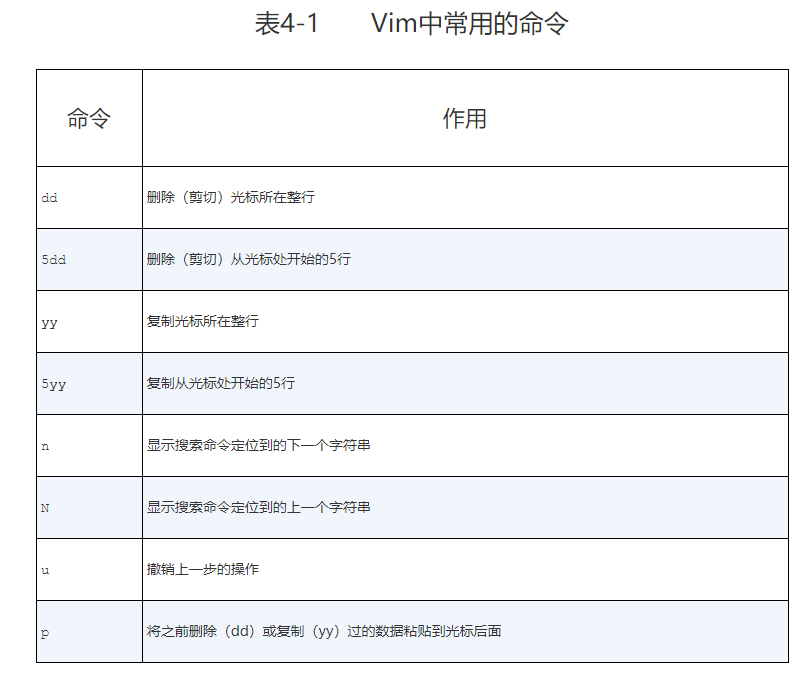
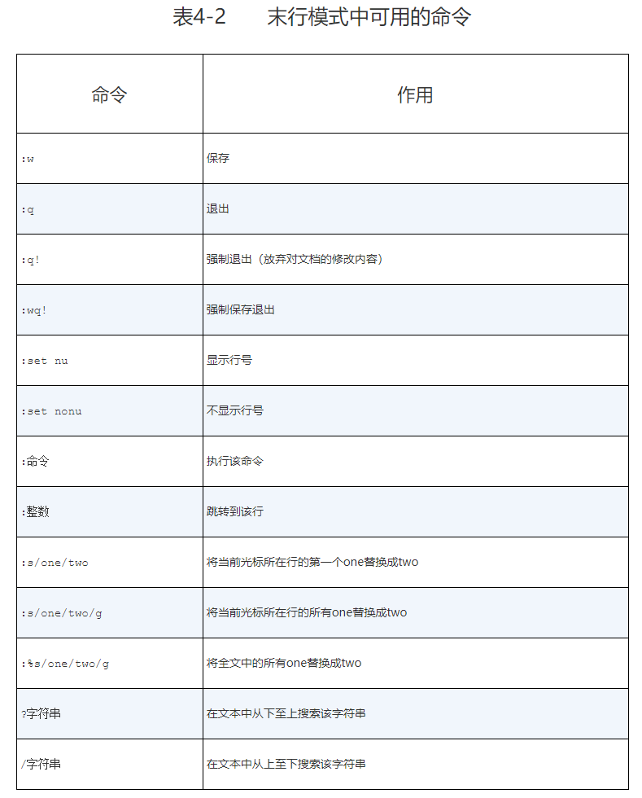
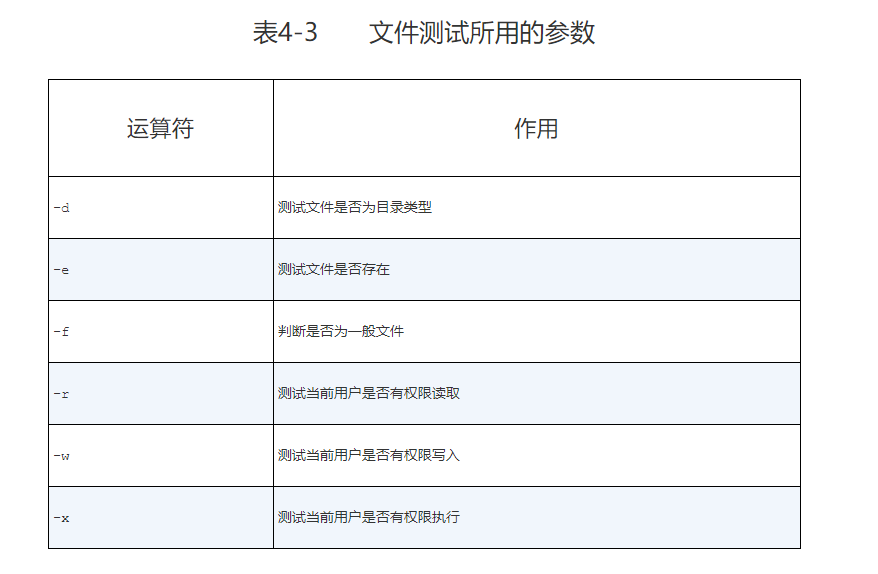
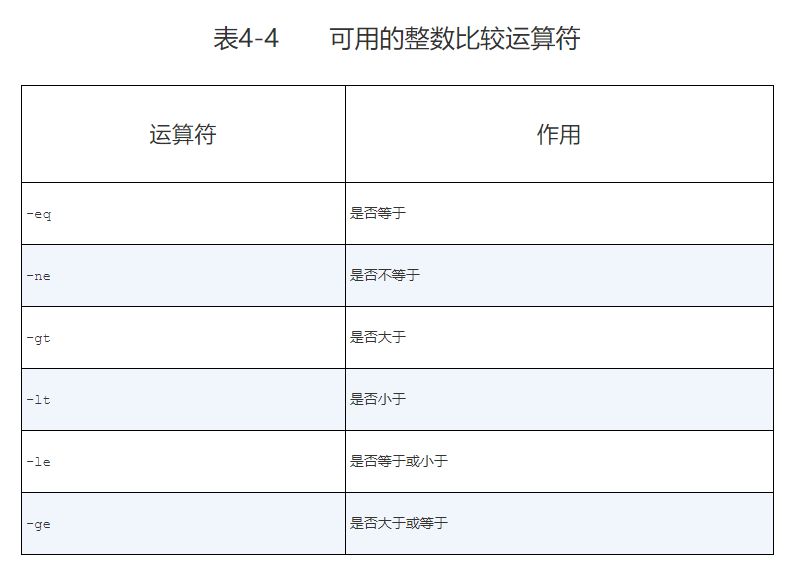
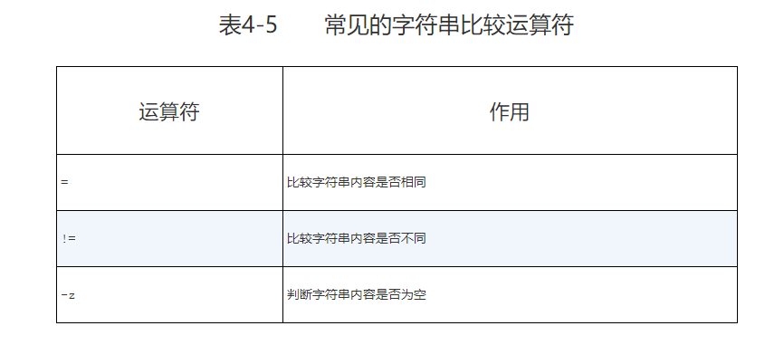

## Vim编辑器与Shell命令脚本

在Linux系统中一切都是文件，而配置一个服务就是在修改其配置文件的参数

### vim 模式
1. 命令模式：控制光标移动，可对文本进行复制、粘贴、删除和查找等工作。
2. 输入模式：正常的文本录入。
3. 末行模式：保存或退出文档，以及设置编辑环境。

在每次运行Vim编辑器时，默认进入命令模式，此时需要先切换到输入模式后再进行文档编写工作，而每次在编写完文档后需要先返回命令模式，然后再进入末行模式，执行文档的保存或退出操作。





### 修改主机名
```
vim /etc/hostname
```
### 修改网络配置
在RHEL 5、RHEL 6中，网卡配置文件的前缀为eth，第1块网卡为eth0，第2块网卡为eth1；以此类推。而在RHEL 7中，网卡配置文件的前缀则以ifcfg开始，加上网卡名称共同组成了网卡配置文件的名字，例如ifcfg-eno16777736

第1步：首先切换到/etc/sysconfig/network-scripts目录中（存放着网卡的配置文件。

第2步：使用Vim编辑器修改网卡文件ifcfg-eno16777736，逐项写入下面的配置参数并保存退出。由于每台设备的硬件及架构是不一样的，因此请读者使用ifconfig命令自行确认各自网卡的默认名称。

第3步：重启网络服务并测试网络是否联通。
```
systemctl restart network
```

### 配置yum仓库
第1步：进入到/etc/yum.repos.d/目录中（因为该目录存放着Yum软件仓库的配置文件）。

第2步：使用Vim编辑器创建一个名为rhel7.repo的新配置文件（文件名称可随意，但后缀必须为.repo），逐项写入下面加粗的配置参数并保存退出（不要写后面的中文注释）。
```
[rhel-media] ：Yum软件仓库唯一标识符，避免与其他仓库冲突。
name=linuxprobe：Yum软件仓库的名称描述，易于识别仓库用处。
baseurl=file:///media/cdrom：提供的方式包括FTP（ftp://..）、HTTP（http://..）、本地（file:///..）。
enabled=1：设置此源是否可用；1为可用，0为禁用。
gpgcheck=1：设置此源是否校验文件；1为校验，0为不校验。
gpgkey=file:///media/cdrom/RPM-GPG-KEY-redhat-release：若上面参数开启校验，那么请指定公钥文件地址。
```

第3步：按配置参数的路径挂载光盘，并把光盘挂载信息写入到/etc/fstab文件中。

第4步：使用“yum install httpd -y”命令检查Yum软件仓库是否已经可用。

### 编写shell脚本
#### 接收用户输入参数

例如$0对应的是当前Shell脚本程序的名称，$#对应的是总共有几个参数，$*对应的是所有位置的参数值，$?对应的是显示上一次命令的执行返回值，而$1、$2、$3……则分别对应着第N个位置的参数值

#### 测试语句
Shell脚本中的条件测试语法可以判断表达式是否成立，若条件成立则返回数字0，否则便返回其他随机数值。


##### 文件测试语句；



#### 逻辑测试语句

逻辑与 && 前一个命令成功后执行后一个命令

逻辑或 || 前一个命令执行失败后才执行后一个命令 

逻辑非 ! 在Linux系统中的运算符号是一个叹号（！），它表示把条件测试中的判断结果取相反值。


#### 整数值比较语句
整数比较运算符仅是对数字的操作，不能将数字与字符串、文件等内容一起操作



#### 字符串比较语句。
字符串比较语句用于判断测试字符串是否为空值，或两个字符串是否相同。



### 选择语句

```shell
#!/bin/bash
ping -c 3 -i 0.2 -W 3 $1 &> /dev/null
if [ $? -eq 0 ]
then
echo "Host $1 is On-line."
else
echo "Host $1 is Off-line."
fi
```

```shell
#!/bin/bash
read -p "Enter your score（0-100）：" GRADE
if [ $GRADE -ge 85 ] && [ $GRADE -le 100 ] ; then
echo "$GRADE is Excellent"
elif [ $GRADE -ge 70 ] && [ $GRADE -le 84 ] ; then
echo "$GRADE is Pass"
else
echo "$GRADE is Fail" 
fi
[root@linuxprobe ~]# bash chkscore.sh
Enter your score（0-100）：88
88 is Excellent
[root@linuxprobe ~]# bash chkscore.sh 
Enter your score（0-100）：80
80 is Pass
```

```shell
#!/bin/bash
read -p "请输入一个字符，并按Enter键确认：" KEY
case "$KEY" in
[a-z]|[A-Z])
echo "您输入的是 字母。"
;;
[0-9])
echo "您输入的是 数字。"
;;
*)
echo "您输入的是 空格、功能键或其他控制字符。"
esac
```


### 循环语句

**/dev/null是一个被称作Linux黑洞的文件，把输出信息重定向到这个文件等同于删除数据（类似于没有回收功能的垃圾箱），可以让用户的屏幕窗口保持简洁。**

```shell
#!/bin/bash
read -p "Enter The Users Password : " PASSWD
for UNAME in `cat users.txt`
do
id $UNAME &> /dev/null
if [ $? -eq 0 ]
then
echo "Already exists"
else
useradd $UNAME &> /dev/null
echo "$PASSWD" | passwd --stdin $UNAME &> /dev/null
if [ $? -eq 0 ]
then
echo "$UNAME , Create success"
else
echo "$UNAME , Create failure"
fi
fi
done
```
```shell
#!/bin/bash
#测试主机是否在线
HLIST=$(cat ~/ipadds.txt)
for IP in $HLIST
do
ping -c 3 -i 0.2 -W 3 $IP &> /dev/null
if [ $? -eq 0 ] ; then
echo "Host $IP is On-line."
else
echo "Host $IP is Off-line."
fi
done
```
```shell
#!/bin/bash
PRICE=$(expr $RANDOM % 1000)
TIMES=0
echo "商品实际价格为0-999之间，猜猜看是多少？"
while true
do
read -p "请输入您猜测的价格数目：" INT
let TIMES++
if [ $INT -eq $PRICE ] ; then
echo "恭喜您答对了，实际价格是 $PRICE"
echo "您总共猜测了 $TIMES 次"
exit 0
elif [ $INT -gt $PRICE ] ; then
echo "太高了！"
else
echo "太低了！"
fi
done
```