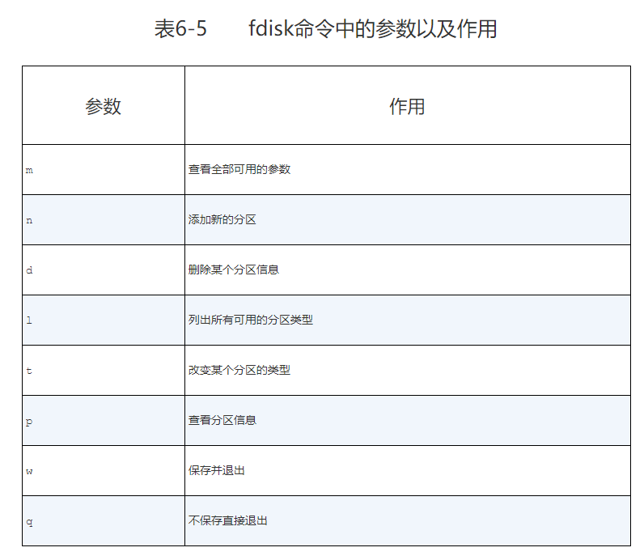

## 存储结构和磁盘划分
### 添加硬盘设备

在Linux系统中，管理硬盘设备最常用的方法就当属fdisk命令了。fdisk命令用于管理磁盘分区，格式为“fdisk [磁盘名称]”，它提供了集添加、删除、转换分区等功能于一身的“一站式分区服务”。

#### fdisk 
分区。


#### mkfs
```
mkfs.xfs /dev/sdb1
```
格式化分区为指定文件系统。

#### 挂载并使用存储设备
```
mount /dev/sdb1 /mydisk
```

```
df -h
```
#### du
查看文件数据占用量的du命令，其格式为“du [选项] [文件]”。
```
du -sh /mydisk
```
#### 挂载写入配置文件fstab
```
/dev/sdb1                                  /mydisk       xfs       defaults   0 0
```
### 添加交换分区
虚拟内存

SWAP（交换）分区是一种通过在硬盘中预先划分一定的空间，然后将把内存中暂时不常用的数据临时存放到硬盘中，以便腾出物理内存空间让更活跃的程序服务来使用的技术，其设计目的是为了解决真实物理内存不足的问题。

在生产环境中，交换分区的大小一般为真实物理内存的1.5～2倍，为了让大家更明显地感受交换分区空间的变化，这里取出一个大小为5GB的主分区作为交换分区资源。

操作步骤
```
fdisk新建一个分区
partprobe
mkswap /dev/sdb2
swapon /dev/sdb2
free -m
```

写入 /etc/fstab
```
/dev/sdb2                                 swap         swap      defaults   0 0
```

### 磁盘容量配额
