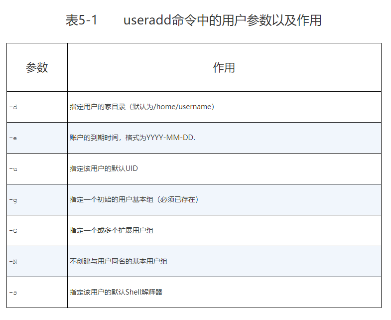
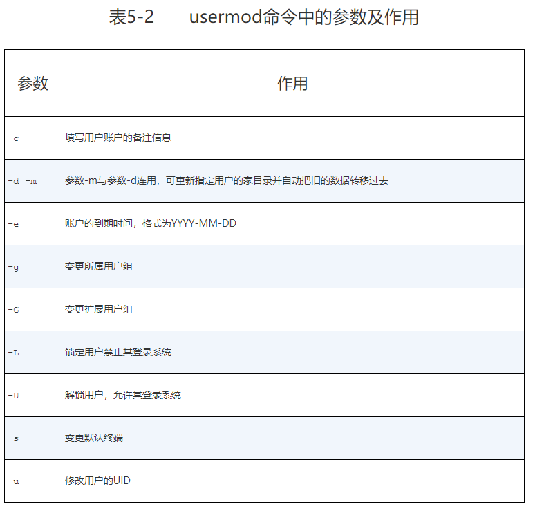
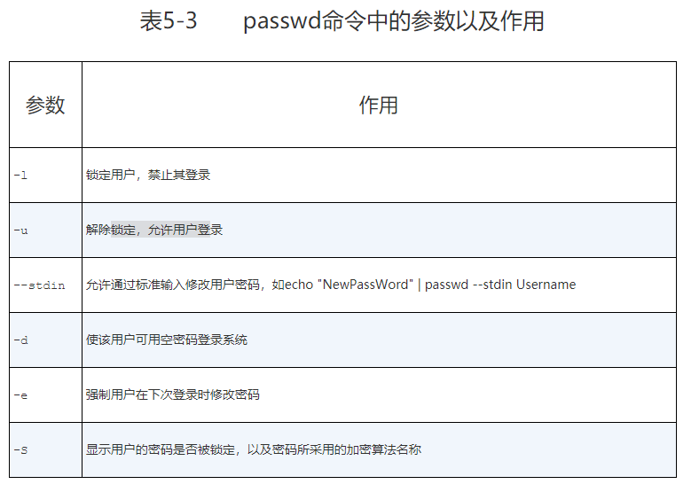
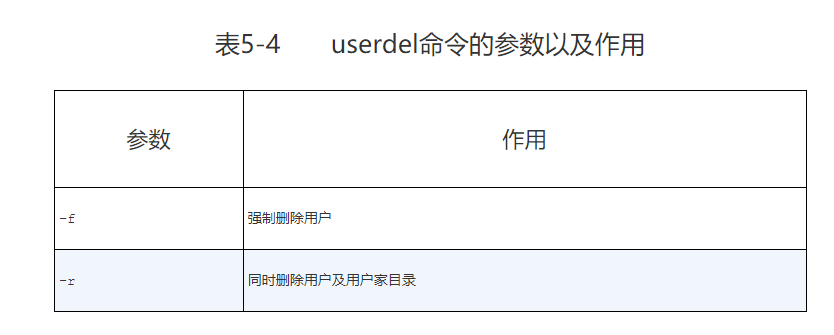
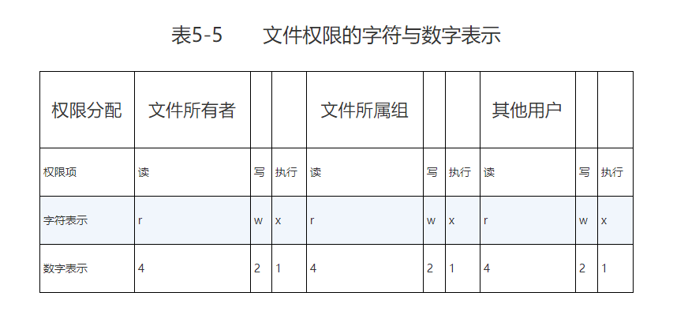
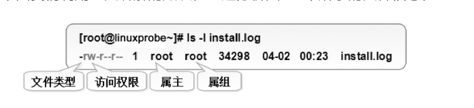
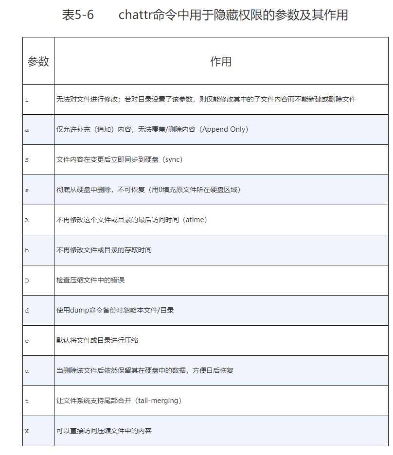
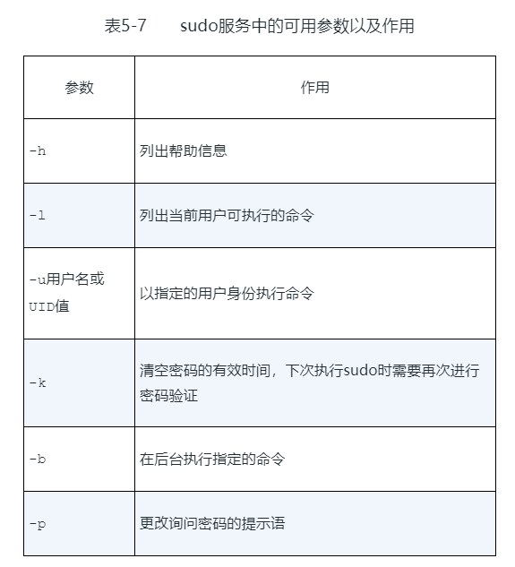

## 用户身份和文件权限

### 用户管理
设计Linux系统的初衷之一就是为了满足多个用户同时工作的需求,特别要求设置root管理员密码，这个root管理员就是存在于所有类UNIX系统中的超级用户。

```
管理员UID为0：系统的管理员用户。
系统用户UID为1～999： Linux系统为了避免因某个服务程序出现漏洞而被黑客提权至整台服务器，默认服务程序会有独立的系统用户负责运行，进而有效控制被破坏范围。
普通用户UID从1000开始：是由管理员创建的用于日常工作的用户。

在Linux系统中创建每个用户时，将自动创建一个与其同名的基本用户组，而且这个基本用户组只有该用户一个人。如果该用户以后被归纳入其他用户组，则这个其他用户组称之为扩展用户组。一个用户只有一个基本用户组，但是可以有多个扩展用户组，从而满足日常的工作需要。
```

#### useradd
useradd命令用于创建新的用户，格式为“useradd [选项] 用户名”。



```shell
[root@linuxprobe ~]# useradd -d /home/linux -u 8888 -s /sbin/nologin linuxprobe
[root@linuxprobe ~]# id linuxprobe
uid=8888(linuxprobe) gid=8888(linuxprobe) groups=8888(linuxprobe)
```
#### groupadd
groupadd命令用于创建用户组，格式为“groupadd [选项] 群组名”。

#### usermod
usermod命令用于修改用户的属性，格式为“usermod [选项] 用户名”。


#### passwd
passwd命令用于修改用户密码、过期时间、认证信息等，格式为“passwd [选项] [用户名]”。


#### userdel
userdel命令用于删除用户，格式为“userdel [选项] 用户名”。


### 文件权限和归属

尽管在Linux系统中一切都是文件，但是每个文件的类型不尽相同，因此Linux系统使用了不同的字符来加以区分，常见的字符如下所示。

```
-：普通文件。
d：目录文件。
l：链接文件。
b：块设备文件。
c：字符设备文件。
p：管道文件。
```

每个文件都有所属的所有者和所有组，并且规定了文件的所有者、所有组以及其他人对文件所拥有的可读（r）、可写（w）、可执行（x）等权限。

目录文件的权限设置。对目录文件来说，“可读”表示能够读取目录内的文件列表；“可写”表示能够在目录内新增、删除、重命名文件；而“可执行”则表示能够进入该目录。





### 文件特殊权限

SUID、SGID与SBIT的特殊权限位
```
SUID
是一种对二进制程序进行设置的特殊权限，可以让二进制程序的执行者临时拥有属主的权限（仅对拥有执行权限的二进制程序有效）。

查看passwd命令属性时发现所有者的权限由rwx变成了rws，其中x改变成s就意味着该文件被赋予了SUID权限。另外有读者会好奇，那么如果原本的权限是rw-呢？如果原先权限位上没有x执行权限，那么被赋予特殊权限后将变成大写的S。
```
```
SGID
让执行者临时拥有属组的权限（对拥有执行权限的二进制程序进行设置）；
在某个目录中创建的文件自动继承该目录的用户组（只可以对目录进行设置）。
```

```
SBIT
保护位

因此除非是该目录的所有者，否则无法删除这里面的文件。

当目录被设置SBIT特殊权限位后，文件的其他人权限部分的x执行权限就会被替换成t或者T，原本有x执行权限则会写成t，原本没有x执行权限则会被写成T。

chmod -R o+t linux/
```

#### chmod
“chmod [参数] 权限 文件或目录名称”

#### chown
“chown [参数] 所有者:所属组 文件或目录名称”。

chmod和chown命令是用于修改文件属性和权限的最常用命令，它们还有一个特别的共性，就是针对目录进行操作时需要加上大写参数-R来表示递归操作，即对目录内所有的文件进行整体操作。

#### chattr
chattr命令用于设置文件的隐藏权限，格式为“chattr [参数] 文件”。如果想要把某个隐藏功能添加到文件上，则需要在命令后面追加“+参数”，如果想要把某个隐藏功能移出文件，则需要追加“-参数”。



#### lsattr
lsattr命令用于显示文件的隐藏权限，格式为“lsattr [参数] 文件”

#### setfacl

setfacl命令用于管理文件的ACL规则，格式为“setfacl [参数] 文件名称”。

使用setfacl命令可以针对单一用户或用户组、单一文件或目录来进行读/写/执行权限的控制。其中，针对目录文件需要使用-R递归参数；针对普通文件则使用-m参数；如果想要删除某个文件的ACL，则可以使用-b参数。

```
setfacl -Rm u:linuxprobe:rwx /root
```

怎么去查看文件上有那些ACL呢？常用的ls命令是看不到ACL表信息的，但是却可以看到文件的权限最后一个点（.）变成了加号（+）,这就意味着该文件已经设置了ACL了。

#### getfacl
getfacl命令用于显示文件上设置的ACL信息，格式为“getfacl 文件名称”。
```
getfacl /root
```

#### su
切换用户

面的su命令与用户名之间有一个减号（-），这意味着完全切换到新的用户，即把环境变量信息也变更为新用户的相应信息，而不是保留原始的信息。强烈建议在切换用户身份时添加这个减号（-）。


#### sudo
sudo命令用于给普通用户提供额外的权限来完成原本root管理员才能完成的任务，格式为“sudo [参数] 命令名称”



作用为：
1. 限制用户执行指定的命令；
2. 2记录用户执行的每一条命令；
3. 配置文件（/etc/sudoers）提供集中的用户管理、权限与主机等参数；
4. 验证密码的后5分钟内（默认值）无须再让用户再次验证密码。

#### visudo
配置sudo权限管理

```
visudo: >>> /etc/sudoers: syntax error near line 111 <<<
What now?
Options are:
(e)dit sudoers file again
(x)it without saving changes to sudoers file
(Q)uit and save changes to sudoers file (DANGER!)
```