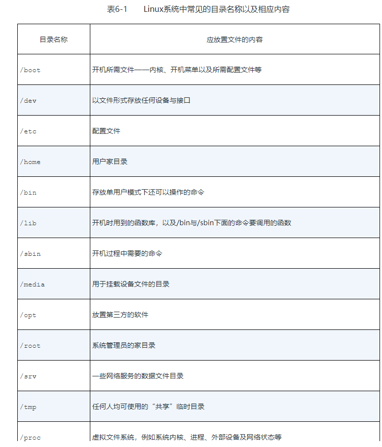
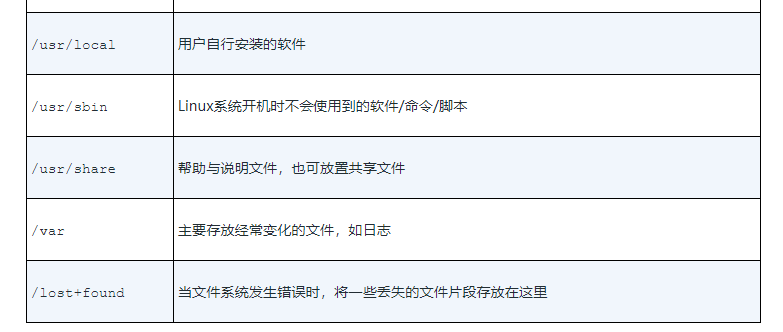
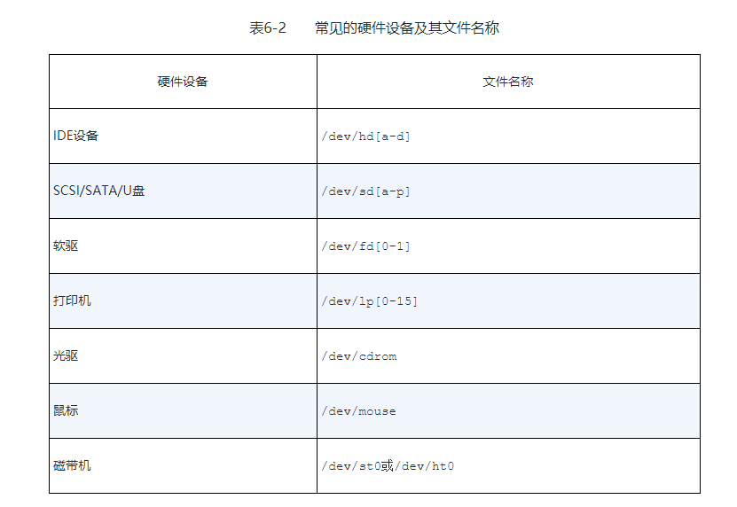
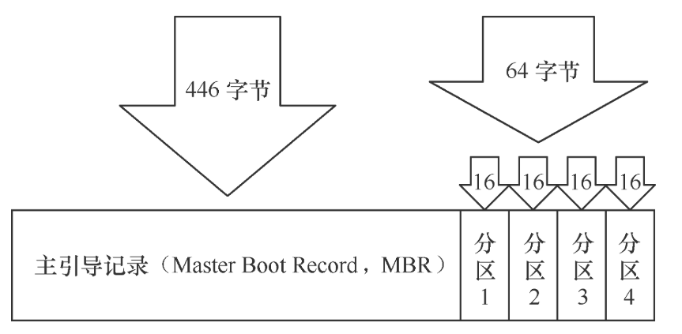
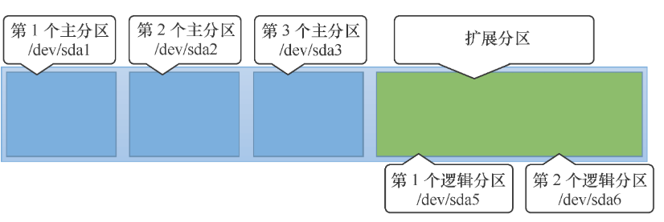
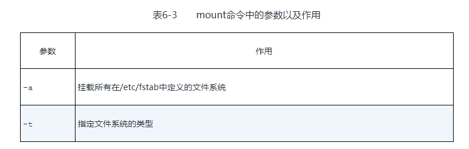
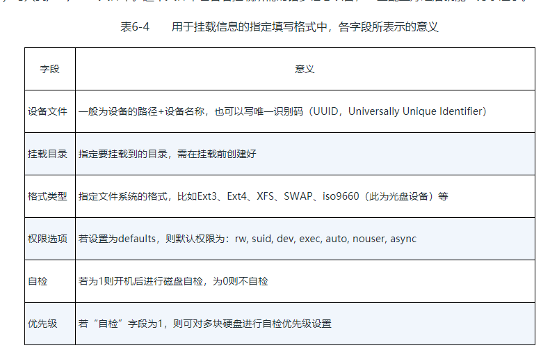
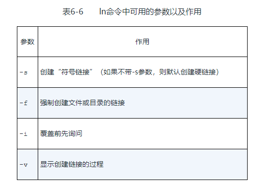

## 存储结构和磁盘划分

### 目录结构约定
 
> 在Linux系统中，目录、字符设备、块设备、套接字、打印机等都被抽象成了文件

> Linux系统中的一切文件都是从“根（/）”目录开始的，并按照文件系统层次化标准（FHS）采用树形结构来存放文件，以及定义了常见目录的用途。另外，Linux系统中的文件和目录名称是严格区分大小写的。

常用的目录约定。



### 物理设备命名规则
硬盘的分区规则：主分区或扩展分区的编号从1开始，到4结束；逻辑分区从编号5开始。


#### MBR分区原理

硬盘设备是由大量的扇区(sector)组成的，每个扇区的容量为512字节。其中第一个扇区最重要，它里面保存着主引导记录与分区表信息。就第一个扇区来讲，主引导记录需要占用446字节，分区表为64字节，结束符占用2字节；其中分区表中每记录一个分区信息就需要16字节，这样一来最多只有4个分区信息可以写到第一个扇区中，这4个分区就是4个主分区。第一个扇区中的数据信息如图6-3所示。



第一个扇区最多只能创建出4个分区？于是为了解决分区个数不够的问题，可以将第一个扇区的分区表中16字节（原本要写入主分区信息）的空间（称之为扩展分区）拿出来指向另外一个分区。也就是说，扩展分区其实并不是一个真正的分区，而更像是一个占用16字节分区表空间的指针——一个指向另外一个分区的指针。这样一来，用户一般会选择使用3个主分区加1个扩展分区的方法，然后在扩展分区中创建出数个逻辑分区，从而来满足多分区（大于4个）的需求。



所以逻辑分区和主分区没有什么区别。

### 文件系统解析

常见文件系统

```
Ext3：是一款日志文件系统，能够在系统异常宕机时避免文件系统资料丢失，并能自动修复数据的不一致与错误。然而，当硬盘容量较大时，所需的修复时间也会很长，而且也不能百分之百地保证资料不会丢失。它会把整个磁盘的每个写入动作的细节都预先记录下来，以便在发生异常宕机后能回溯追踪到被中断的部分，然后尝试进行修复。

Ext4：Ext3的改进版本，作为RHEL 6系统中的默认文件管理系统，它支持的存储容量高达1EB（1EB=1,073,741,824GB），且能够有无限多的子目录。另外，Ext4文件系统能够批量分配block块，从而极大地提高了读写效率。

XFS：是一种高性能的日志文件系统，而且是RHEL 7中默认的文件管理系统，它的优势在发生意外宕机后尤其明显，即可以快速地恢复可能被破坏的文件，而且强大的日志功能只用花费极低的计算和存储性能。并且它最大可支持的存储容量为18EB，这几乎满足了所有需求。
```
在拿到了一块新的硬盘存储设备后，也需要先分区，然后再格式化文件系统，最后才能挂载并正常使用。

linux中，文件是通过一个个block存储数据的，block是1kb，2kb，4kb不一定。

inode 是文件元信息，占128字节，类似索引。存储着文件的block位置等。就可以读取文件了。

```
Linux内核中的软件层为用户程序提供了一个VFS（Virtual File System，虚拟文件系统）接口，这样用户实际上在操作文件时就是统一对这个虚拟文件系统进行操作了。类似jdbc。
```

### 挂载硬件设备

为什么要挂载，以u盘为例

当用户需要使用硬盘设备或分区中的数据时，需要先将其与一个已存在的目录文件进行关联，而这个关联动作就是“挂载”。

#### mount
mount命令用于挂载文件系统，格式为“mount 文件系统 挂载目录”



```
mount /dev/sdb2 /backup
```

如果想让硬件设备和目录永久地进行自动关联，就必须把挂载信息按照指定的填写格式“设备文件 挂载目录 格式类型 权限选项 自检 优先级”（各字段的意义见表6-4）写入到/etc/fstab文件中。



#### umount

umount命令用于撤销已经挂载的设备文件，格式为“umount [挂载点/设备文件]”。
```
 umount /dev/sdb2
```


### 添加硬盘设备

在Linux系统中，管理硬盘设备最常用的方法就当属fdisk命令了。fdisk命令用于管理磁盘分区，格式为“fdisk [磁盘名称]”，它提供了集添加、删除、转换分区等功能于一身的“一站式分区服务”。

#### fdisk 
分区。


#### mkfs
```
mkfs.xfs /dev/sdb1
```
格式化分区为指定文件系统。

#### 挂载并使用存储设备
```
mount /dev/sdb1 /mydisk
```

```
df -h
```
#### du
查看文件数据占用量的du命令，其格式为“du [选项] [文件]”。
```
du -sh /mydisk
```
#### 挂载写入配置文件fstab
```
/dev/sdb1                                  /mydisk       xfs       defaults   0 0
```
### 添加交换分区
虚拟内存

SWAP（交换）分区是一种通过在硬盘中预先划分一定的空间，然后将把内存中暂时不常用的数据临时存放到硬盘中，以便腾出物理内存空间让更活跃的程序服务来使用的技术，其设计目的是为了解决真实物理内存不足的问题。

在生产环境中，交换分区的大小一般为真实物理内存的1.5～2倍，为了让大家更明显地感受交换分区空间的变化，这里取出一个大小为5GB的主分区作为交换分区资源。

操作步骤
```
fdisk新建一个分区
partprobe
mkswap /dev/sdb2
swapon /dev/sdb2
free -m
```

写入 /etc/fstab
```
/dev/sdb2                                 swap         swap      defaults   0 0
```

### 磁盘容量配额
可以使用quota命令进行磁盘容量配额管理，从而限制用户的硬盘可用容量或所能创建的最大文件个数。quota命令还有软限制和硬限制的功能。


#### xfs_quota
xfs_quota命令是一个专门针对XFS文件系统来管理quota磁盘容量配额服务而设计的命令，格式为“quota [参数] 配额 文件系统”。
```
xfs_quota -x -c 'limit bsoft=3m bhard=6m isoft=3 ihard=6 tom' /boot

xfs_quota -x -c report /boot
```

#### edquota
edquota命令用于编辑用户的quota配额限制，格式为“edquota [参数] [用户] ”。

### 快捷方式

在Linux系统中存在硬链接和软连接两种文件。

硬链接（hard link）“指向原始文件inode的指针”，硬链接文件与原始文件其实是同一个文件，只是名字不同。由于技术的局限性，我们不能跨分区对目录文件进行链接。

软链接（也称为符号链接[symbolic link]）：仅仅包含所链接文件的路径名，因此能链接目录文件，也可以跨越文件系统进行链接。

#### ln
ln命令用于创建链接文件，格式为“ln [选项] 目标”，注意软硬连接的区别。


