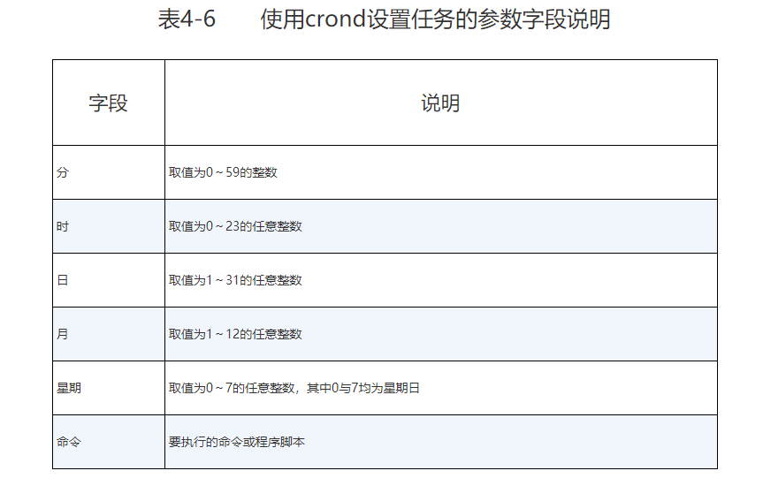

## 计划任务

计划任务分为一次性计划任务与长期性计划任务，大家可以按照如下方式理解。


### 一次性计划任务：今晚11点30分开启网站服务。
```shell
echo "systemctl restart network" | at 21:04

at -l 
arrm 
```

### 长期性计划任务

使用 linux内置的cron服务。

创建、编辑计划任务的命令为“crontab -e”，查看当前计划任务的命令为“crontab -l”，删除某条计划任务的命令为“crontab -r”

格式为 ： “分、时、日、月、星期 命令”

计划任务中的“分”字段必须有数值，绝对不能为空或是*号，而“日”和“星期”字段不能同时使用，否则就会发生冲突。



使用绝对路径来写命令。
