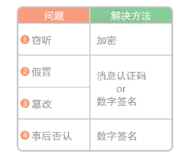

## 算法概述
### 时间复杂度定义
>时间复杂度是一个可以描述算法运行时间的函数，常用大 O 符号来表述。读作order。又称阶。

### 数据结构
>内存中数据存储方式

#### 链表
链表是数据结构之一，其中的数据呈线性排列。在链表中，数据的添加和删除都较为方便，就是访问比较耗费时间。
#### 数组
数组也是数据呈线性排列的一种数据结构。与前一节中的链表不同，在数组中，访问数据十分简单，而添加和删除数据比较耗工夫。
#### 栈
栈就像是一摞书，拿到新书时我们会把它放在书堆的最上面，取书时也只能从最上面的新书开始取。栈这种最后添加的数据最先被取出，即“后进先出”的结构，我们称为 Last In First Out，简称 LIFO。

使用场景：深度优先搜索。

#### 队列
类似排队，队列这种最先进去的数据最先被取来，即“先进先出”的结构，我们称为 First In First Out，简称 FIFO。

使用场景：广度优先搜索。

#### 哈希表
由哈希函数计算出的值进行地址分配。

在哈希表中，我们可以利用哈希函数快速访问到数组中的目标数据。如果发生哈希冲突，就使用链表进行存储。这样一来，不管数据量为多少，我们都能够灵活应对。

#### 堆
堆是一种图的树形结构，被用于实现“优先队列”（priority queues）

堆中的每个结点最多有两个子结点。树的形状取决于数据的个数。另外，结点的排列顺序为从上到下，同一行里则为从左到右。

在堆中存储数据时必须遵守这样一条规则：子结点必定大于父结点。

#### 二叉搜索树

二叉查找树有两个性质。第一个是每个结点的值均大于其左子树上任意一个结点的值。第二个是每个结点的值均小于其右子树上任意一个结点的值。

### 排序
#### 冒泡排序
冒泡排序就是重复“从序列右边开始比较相邻两个数字的大小，再根据结果交换两个数字的位置”这一操作的算法。

#### 选择排序
选择排序就是重复“从待排序的数据中寻找最小值，将其与序列最左边的数字进行交换”这一操作的算法。在序列中寻找最小值时使用的是线性查找。

#### 插入排序
插入排序是一种从序列左端开始依次对数据进行排序的算法。在排序过程中，左侧的数据陆续归位，而右侧留下的就是还未被排序的数据。插入排序的思路就是从右侧的未排序区域内取出一个数据，然后将它插入到已排序区域内合适的位置上。

#### 堆排序
堆排序的特点是利用了数据结构中的堆。

#### 归并排序
归并排序算法会把序列分成长度相同的两个子序列，当无法继续往下分时（也就是每个子序列中只有一个数据时），就对子序列进行归并。归并指的是把两个排好序的子序列合并成一个有序序列。该操作会一直重复执行，直到所有子序列都归并为一个整体为止。

#### 快速排序
快速排序算法首先会在序列中随机选择一个基准值（pivot），然后将除了基准值以外的数分为“比基准值小的数”和“比基准值大的数”这两个类别，再将其排列成以下形式。

**[ 比基准值小的数 ] 基准值 [ 比基准值大的数 ]**

接着，对两个“[ ]”中的数据进行排序之后，整体的排序便完成了。对“[ ]”里面的数据进行排序时同样也会使用快速排序。

### 数组的查找
#### 线性查找
线性查找的操作很简单，只要在数组中从头开始依次往下查找即可。

#### 二分查找
它只能查找已经排好序的数据。二分查找通过比较数组中间的数据与目标数据的大小，可以得知目标数据是在数组的左边还是右边。因此，比较一次就可以把查找范围缩小一半。重复执行该操作就可以找到目标数据，或得出目标数据不存在的结论。

### 图的搜索
#### 广度优先搜索
广度优先搜索是一种对图进行搜索的算法。假设我们一开始位于某个顶点（即起点），此时并不知道图的整体结构，而我们的目的是从起点开始顺着边搜索，直到到达指定顶点（即终点）。在此过程中每走到一个顶点，就会判断一次它是否为终点。广度优先搜索会优先从离起点近的顶点开始搜索。

#### 深度优先搜索
深度优先搜索和广度优先搜索一样，都是对图进行搜索的算法，目的也都是从起点开始搜索直到到达指定顶点（终点）。深度优先搜索会沿着一条路径不断往下搜索直到不能再继续为止，然后再折返，开始搜索下一条候补路径。

#### 贝尔曼 - 福特算法

#### 狄克斯特拉算法

就是不存在负数权重时，更适合使用效率较高的狄克斯特拉算法，而存在负数权重时，即便较为耗时，也应该使用可以得到正确答案的贝尔曼 - 福特算法。

#### A* 算法

### 安全算法

#### 传输数据的问题
1. 窃听：A 向 B 发送的消息可能会在传输途中被 X 偷看。这就是“窃听”
2. 假冒：A 以为向 B 发送了消息，然而 B 有可能是 X 冒充的；反过来，B 以为从 A 那里收到了消息，然而 A 也有可能是 X 冒充的。
3. 篡改：即便 B 确实收到了 A 发送的消息，有可能该消息的内容在途中就被 X 更改了。
4. 事后否认：B 从 A 那里收到了消息，但作为消息发送者的 A 可能对 B 抱有恶意，并在事后声称“这不是我发送的消息”
   

#### 哈希函数
哈希函数的算法中具有代表性的是 MD5 1、SHA-1 2和 SHA-2 等。其中 SHA-2 是现在应用较为广泛的一个，而 MD5 和 SHA-1 存在安全隐患，不推荐使用。

#### 共享密钥加密
共享密钥加密是加密和解密都使用相同密钥的一种加密方式。由于使用的密钥相同，所以这种算法也被称为“对称加密”。实现共享密钥加密的算法有凯撒密码、AES3、DES4、动态口令等，其中 AES 的应用最为广泛。

#### 公开密钥加密
公开密钥加密是加密和解密使用不同密钥的一种加密方法。由于使用的密钥不同，所以这种算法也被称为“非对称加密”。加密用的密钥叫作“公开密钥”，解密用的叫作“私有密钥”。

存在问题
1. 无法判断公钥可靠性。可能是伪造的公钥。
2. 发送信息存在事后否认的情况。
3. 公钥加密解密速度比较慢。

#### 混合加密
共享密钥加密存在无法安全传输密钥的密钥分配问题，公开密钥加密又存在加密解密速度较慢的问题。结合这两种方法以实现互补的一种加密方法就是混合加密。

在混合加密中，要用处理速度较快的共享密钥加密对数据进行加密。不过，加密时使用的密钥，则需要用没有密钥分配问题的公开密钥加密进行处理。

混合加密在安全性和处理速度上都有优势。能够为网络提供通信安全的 SSL 协议也应用了混合加密方法。SSL 是 Secure Sockets Layer（安全套接层）的简写，该协议经过版本升级后，现在已正式命名为 TLS（Transport Layer Security，传输层安全）。但是，SSL 这个名字在人们心中已经根深蒂固，因此该协议现在也常被称为 SSL 协议或者 SSL / TLS 协议。

#### 迪菲 - 赫尔曼密钥交换
迪菲 - 赫尔曼（Diffie-Hellman）密钥交换是一种可以在通信双方之间安全交换密钥的方法。这种方法通过将双方共有的秘密数值隐藏在公开数值相关的运算中，来实现双方之间密钥的安全交换。

使用迪菲 - 赫尔曼密钥交换，通信双方仅通过交换一些公开信息就可以实现密钥交换。但实际上，双方并没有交换密钥，而是生成了密钥。因此，该方法又被叫作“迪菲 - 赫尔曼密钥协议”。

#### 消息认证码
消息认证码可以实现“认证”和“检测篡改”这两个功能。密文的内容在传输过程中可能会被篡改，这会导致解密后的内容发生变化，从而产生误会。消息认证码就是可以预防这种情况发生的机制。

加密仅仅是一个数值计算和处理的过程，所以即使密文被篡改了，也能够进行解密相关的计算。

如果原本的消息是很长的句子，那么它被篡改后意思会变得很奇怪，所以接收者有可能会发现它是被篡改过的。

但是，如果原本的消息就是商品编号等无法被人们直接理解的内容，那么解密后接收者便很难判断它是否被篡改。由于密码本身无法告诉人们消息是否被篡改，所以就需要使用消息验证码来检测。

#### 数字签名
数字签名不仅可以实现消息认证码的认证和检测篡改功能，还可以预防事后否认问题的发生。由于在消息认证码中使用的是共享密钥加密，所以持有密钥的收信人也有可能是消息的发送者，这样是无法预防事后否认行为的。而数字签名是只有发信人才能生成的，因此使用它就可以确定谁是消息的发送者了。

虽然数字签名可以实现“认证”“检测篡改”“预防事后否认”三个功能。

缺陷：无法保证公开密钥的真伪。

#### 数字证书

从数字证书认证中心CA(Certification Authority)，获取公钥。这样保证公钥无法伪造。