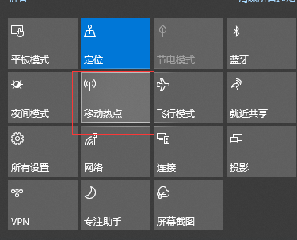
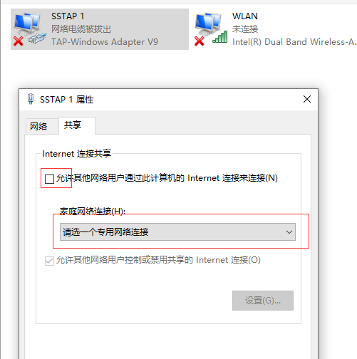

## 我要在这踩一个软软的脚印
## 为什么要刷机
1. 广告（主要原因）
2. 谷歌
   
## 准备工作
以mi9se为例

- [x] 解手机bootloader锁
- [x] 数据线，笔记本电脑
- [x] adb调试工具
- [x] mi9se波兰稳定版刷机包，android 9
- [x] 对应版本的twrp，android 9

## 刷入twrp，类似win10重装的pe。
1. 解锁后进入fastboot模式刷入twrp。然后马上进行第二步。
2. 第一步成功后，立刻进入recovery模式。如果这时不小心重启，就会被miui自带的recovery覆盖。就要重复第一步。
3. 进入twrp后，选择wipe->formatdata->yes。
4. 使用adb工具传输刷机包到根目录下。
```
adb push axxx.zip /
```
5. 然后点击install，选择根目录的刷机包axxx.zip，开始安装。
6. 成功后重启即可。

## 怎么应对谷歌验证
欧版发行的手机要经过谷歌验证更新。国内网络环境是连不上的。所以装好也只能干瞪眼。

解决思路，笔记本使用翻墙工具共享网络到手机上。以SStap为例，开启全局模式并连接。ssr使用代理方式，修改热点的代理地址。
1. pc开启热点，并用手机链接。  
   
2. 修改SStap适配器，把网络共享给pc的开放热点。  
    

然后就可以共享pc的网络了。

## 小结
并不顺利，但操作其实挺简单的。从结果上看这些努力是值得的。

