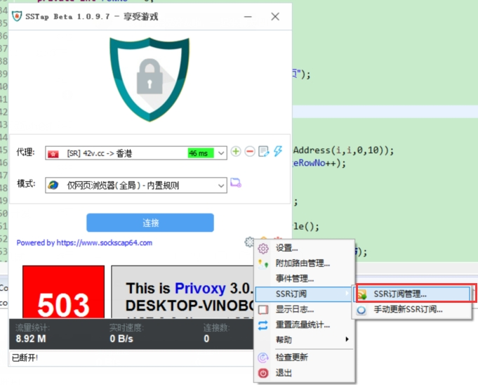
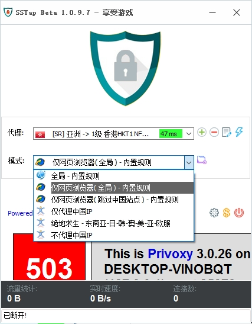

## 科学上网攻略

    欢迎成为ANTI-GFW联盟的一员，很荣幸为你科普我们联盟的使用的高效生产力工具，先附上使用说明书吧。

    安装完成后打开软件，配置如下
       
#### 1.点击设置

#### 2.输入订阅地址点击添加，然后可以关闭此界面。
    订阅地址：https://service.10d.cc/server/subscribe/此处应有密码/ 

#### 3. 执行步骤2后会自动更新订阅地址，具体可以看到主机选择界面，部分结点可能连不上，换一个即可

#### 4. 可以选择使用结点策略

    * 全局，代表启动虚拟网关，当前pc所有软件的请求都走代理服务器。
    * 网页浏览器全局，代表浏览器的所有请求都走代理服务器，但是其他软件比如qq等不受影响。缺点是国内网站访问速度很慢。
    * 浏览器（跳过中国站点），最常用也是推荐使用。访问国内站点不走代理服务器，这样访问国内网站不受影响，速度快。
    * 其他，暂时用不上，常用地址段：97,110,108,106,97,71,86,117

    
#### 5. 点击连接，如果连接失败，请换个结点继续连接，速度慢或者响应慢，也可以换个结点。