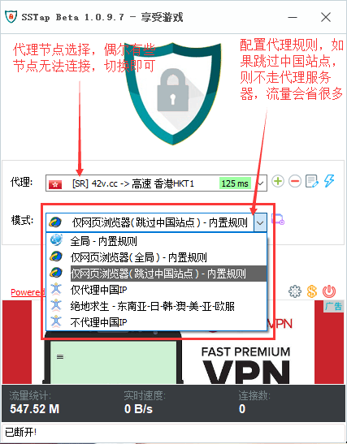

## 科学上网攻略
###  使用第三方翻墙软件，有流量限制
> 稳定，网速快，但有流量限制，可以用每日签到获取流量，平时查阅资料，同步谷歌账号，访问facebook都没有问题。但如果有看视频需求，会有流量瓶颈。

#### 操作步骤

1. 访问 https://my.42v.cc/ 注册账号。
    
2. 注册账号，邀请码是购买流量使用的优惠码。
    
1. 使用教程，签到获取流量。
    
2. 软件下载安装（windows）。
    
3. 软件配置。  
    

###  使用ss搭建vpn服务器
> 需要一台部署在国外的云服务器，国内要连得上。在服务器上安装ss服务端。其他机器就可以用ss客户端连接，并访问外网。成本主要是服务器的租赁费用。
#### 操作步骤
待续……

