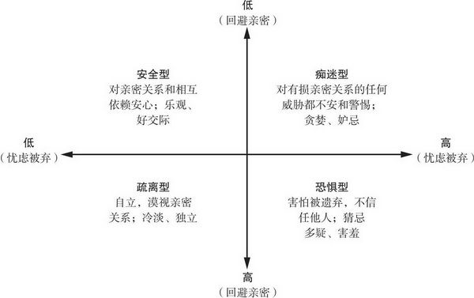

## 读《亲密关系》

#### 情感理论化
之前对情感的模糊认知，让我想当然的以为人与人的关系维系，特别是男女之间，陌生人之间更多是靠直觉，经验，而非理性去联系。

我也没想到这份联系能够理论化，能够通俗易懂的表述出来。以前种种想不通而抛诸脑后暂时搁置起来的问题，现在都有章可查，有理可依。《亲密关系》确实是让我茅舍顿开。

#### 依恋类型
文章所说四种依恋类型了让我豁然开朗。定义如下图

安全型，但凡成长曲线较为平稳健康，他们对于情感的表达如同吃饭喝水一般简单自然，在人际关系上没有什么烦恼。  

痴迷型，渴望别人认同和关注吧，实际上这种心态需要认真对待，如果转换成动力那每天都干劲满满，否则有可能环境影响很难达到目标而自爆。

恐惧型，源头是因为受伤吧，所以拒绝和别人交换真心。没有真的能交心的人，虽然自由，但是比较孤独。

疏离型，一个人我更加自由，走自己的路，并不是很在意别人的看法，更在意自己内心的体验。作为一个独立的个体游走在人群中，很难被他人影响。

依恋类型自定义，如下图

依恋类型一旦成型很难改变，但是如果有什么重大的事情或者大起大落，或者环境变化，都会有影响，特别是成长阶段，身心并不成熟，容易受他人影响。

回想我的经历，那确实有那么点曲折，大起大落谈不上，依恋类型转了几次，画了一个圈，大概安全痴迷恐惧疏离都经历过了吧。

细究缘由还是小时候，大概五岁的时候在村里的小学读书那段时光。父母奔于生计，为温饱奔波，不会太过关心小孩子心里在想什么，那时候没有幼儿园，五岁时候读一年级，和七八岁的熊孩子一起，我在那读了两年之久，都是同村的，不会大打出手，乡下而已,那时候最怕的是别人不和我玩了，但是怕什么来什么，我们家族是从外边搬进来的，主动被动都会有所争执。大人们的争锋相对，小屁孩摇旗呐喊，我还真被孤立了段时间，真是童年阴影，那时候我就患得患失了，对陌生人和高年级学生真的害怕，怕打架怕被骂怕没人玩，所以有点傻。没想到一傻就是小学，初中，甚至是高中。

父母那时候也不懂这个，而且那时候哪里有时间想这些。

对于人际关系的懵懂，让我游离在痴迷型和恐惧型之间，既渴望又怕受伤。到最后封闭自己的情感默默当个路人甲，现在的我只能感叹从前的我真是无可救药啊。

不过话说可怜之人必有可恨之处，这句我是不太赞同的，因为不是所有的可怜都会去报复社会，互相伤害。

那时候的我无论是无心，还是自以为无心，确实伤害到其他人了。现在想想，有很多事情没处理好，没有多想想。

现在呢，变成成了啥样子呢，大概是大学时候开始认真思考人际关系，开始关心自己与自己，自己与他人，自己与社会之间的联系，再到工作的两三年年互相印证调整。逐渐稳定在疏离型人格。我是个没得感情的人哈哈。

至少现在感觉还不错，保持独立，让自己变得更强大，拥抱每天新的变化。

不过我还是觉得安全型的人格最为讨喜，也很有吸引力，跟他们在一起聊天也很舒服。就像在冬天烤火一样。

我很难成为这种人了。

所以我希望我以后的良人是这样的人。善莫大焉！

