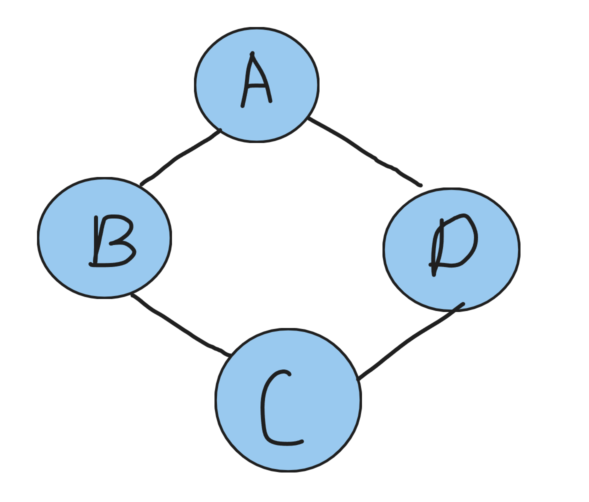
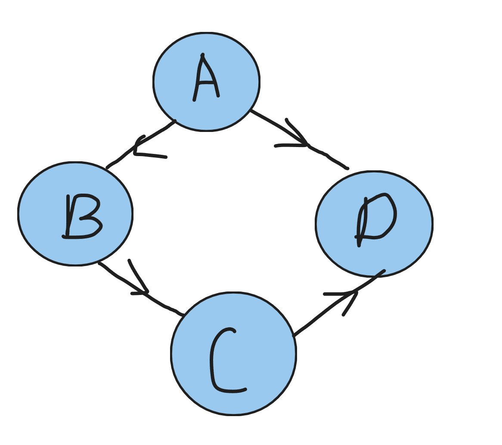
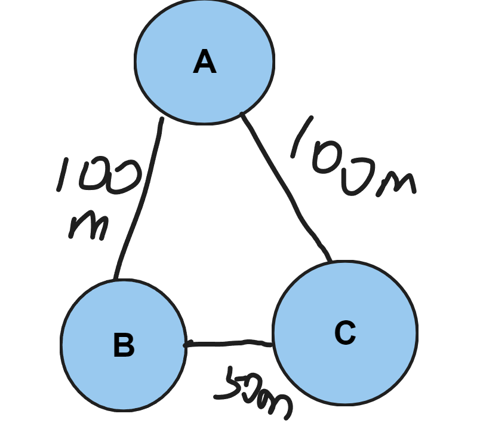

# 图
## 1.1 简介
> 线性表中我们把数据元素叫**元素**，树中把数据元素叫**结点**
> 在树种，叫**顶点**
> 在图中，不允许没有**顶点**
> 在图里面，任意两个顶点之间都可能有关系，这种逻辑关系叫**边**

## 1.2 各种图的定义
> **无向边**：若顶点vi ,vj之间的边没有方向，则称这条边为无向边，用无序偶对(vi,vj)表示
> **无向图**： 如果图中任意两个顶点之间的边都是无向边，那么这个图就叫无向图
> **有向边**：反之，有方向，就称为有向边，也称之为**弧**，用有序偶对<vi,vj>表示，vi为弧头，vj为弧尾
> **有向图**，引申一下上面的就行
> **无向完全图**: 任意两个顶点之间都存在边，就叫无相完全图。n个顶点的无向完全图有$\frac{n \cdot (n-1)}{2}$条边
> **有向完全图**: 任意两个顶点之间都存在两条方向相反的弧，叫有向完全图。n个顶点的有向完全图有$n*(n-1)$条边
> **权**：有些图的边或弧上有与它相关的数字，就叫权，带权的图，通常称为网
> 下面分别是 无向图，有向图，网
> 
> 
> 