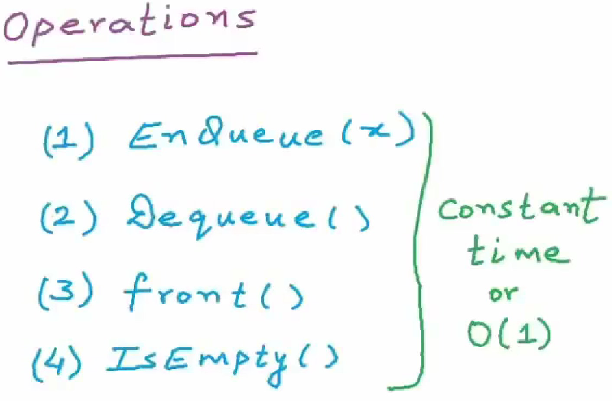

# 队列

队列（Queue）是一种常见的数据结构，它类似于现实生活中的排队等待。队列的操作包括入队（enqueue）和出队（dequeue）两种操作，其中入队将一个元素添加到队列的末尾，出队则从队列的头部删除一个元素。因此，队列是一种先进先出（First-In-First-Out，FIFO）的数据结构。

队列通常有两个指针，一个指向队列的头部，另一个指向队列的尾部。入队操作会将元素添加到尾部指针所指向的位置，同时将尾部指针向后移动一位；出队操作会将头部指针所指向的元素删除，并将头部指针向后移动一位。因此，队列的大小通常由头部指针和尾部指针之间的元素个数确定。

## 数组实现队列

首先，要创建一个队列，需要指定队列的容量。容量是队列中可以存储的最大元素数。创建队列后，可以通过 `push_back()`函数将元素添加到队列的尾部。`push_back()`函数会将元素添加到队列的尾部，并更新队列的大小。

要从队列中删除元素，可以使用 `pop()`函数。`pop()`函数会从队列的头部删除元素，并更新队列的大小。

要获取队列的头部元素，可以使用 `front()`函数。`front()`函数会返回队列的头部元素，但不会从队列中删除元素。

要获取队列的尾部元素，可以使用 `back()`函数。`back()`函数会返回队列的尾部元素，但不会从队列中删除元素。

要获取队列的大小，可以使用 `size()`函数。`size()`函数会返回队列中元素的数量。

要遍历队列中的所有元素，可以使用 `print()`函数。`print()`函数会打印队列中的所有元素，从头到尾。

下面，我来详细讲讲每个函数的实现。

* `Queue(int capacity)`函数是构造函数，它会创建一个队列，并指定队列的容量。
* `~Queue()`函数是析构函数，它会释放队列所占用的内存。
* `bool empty()`函数会检查队列是否为空。如果队列为空，则函数会返回true，否则返回false。
* `void push_back(int value)`函数会将元素添加到队列的尾部。如果队列已满，则函数会打印一条错误信息，并返回。
* `void pop()`函数会从队列的头部删除元素。如果队列为空，则函数会打印一条错误信息，并返回。
* `int front()`函数会返回队列的头部元素，但不会从队列中删除元素。如果队列为空，则函数会打印一条错误信息，并返回-1。
* `int back()`函数会返回队列的尾部元素，但不会从队列中删除元素。如果队列为空，则函数会打印一条错误信息，并返回-1。
* `int size()`函数会返回队列中元素的数量。如果队列为空，则函数会返回0。
* `void print()`函数会打印队列中的所有元素，从头到尾。如果队列为空，则函数不会打印任何内容。

```c++
#include <iostream>
class Queue
{

public:
    Queue(int capacity) : capacity_(capacity), size_(0), front_(-1), rear_(-1)
    {
        data_ = new int[capacity_];
    }
    ~Queue()
    {
        delete[] data_;
    }
    bool empty()
    {
        if (size_ == 0)
        {
            return true;
        }
        else
        {
            return false;
        }
    }
    void push_back(int value) //入队操作
    {
        if (size_ == capacity_) // 队列已满
        {
            std::cout << "Queue is full!" << std::endl;
            return;
        }
        else if (empty()) // 如果是空的，直接让front_和rear_指向第一个元素
        {
            front_ = 0;
            rear_ = 0; // 队列中已有元素，front_ 和 rear_ 都指向第一个元素
        }
        else // 如果没有满，就让rear_指向下一个元素，然后把元素放进去
        {
            rear_ = (rear_ + 1) % capacity_; //循环队列，可以重复利用空间
        }
        data_[rear_] = value;
        size_++;
    }
    void pop() //出队操作
    {
        if (size_ == 0)
        {
            std::cout << "Queue is empty!" << std::endl;
            return;
        }
        else if (front_ == rear_) // 如果只有一个元素，那么就把front_和rear_都置为-1
        {
            front_ = -1;
            rear_ = -1;
            size_ = 0;
        }
        else
        {
            front_++;
            size_--;
        }
    }
    int front() //返回队头元素
    {
        if (size_ == 0)
        {
            std::cout << "Queue is empty!" << std::endl;
            return -1;
        }
        else
        {
            return data_[front_];
        }
    }
    int back() //返回队尾元素
    {
        if (size_ == 0)
        {
            std::cout << "Queue is empty!" << std::endl;
            return -1;
        }
        else
        {
            return data_[rear_];
        }
    }
    int size() {
        return size_;
    }
    //遍历队列
    void print() {
        if (size_ == 0) {
            std::cout << "Queue is empty!" << std::endl;
            return;
        }
        else {
            for (int i = front_; i != rear_; i = (i + 1) % capacity_) {
                std::cout << data_[i] << " ";
            }
            std::cout << data_[rear_] << std::endl;
        }
    }
private:
    int *data_;
    int capacity_;
    int size_;
    int front_;
    int rear_;
    /* 
  
    data_：一个整型数组，用于保存队列中的元素。
    capacity_：队列的容量。
    size_：队列中元素的个数。
    front_：队列头部元素的下标。
    rear_：队列尾部元素的下标。
  
     */
};
int main(void) {
    Queue q(5);
    q.push_back(1);
    q.push_back(2);
    q.push_back(3);
    q.push_back(4);
    q.push_back(5);
    std::cout << "front: " << q.front() << std::endl;
    std::cout << "back: " << q.back() << std::endl;
    std::cout << "size: " << q.size() << std::endl;
    std::cout << "Pop the first element of the queue: " << std::endl; // "出队操作
    q.pop();
    std::cout << "front: " << q.front() << std::endl;
    std::cout << "back: " << q.back() << std::endl;
    std::cout << "size: " << q.size() << std::endl;
    std::cout << "**************************" << std::endl;
    std::cout << "Print the queue: " << std::endl;
    q.print();
    return 0;
}
```

这里面用到了循环队列，关于循环队列的资料

循环队列是一种线性数据结构，它的操作基于先进先出（FIFO）原则，队尾被连接在队首之后以形成一个循环。它能够有效地利用空间，避免了普通队列在出队操作后产生的空间浪费。

这里有一些国际网站上关于循环队列的资料，您可以参考一下：

- [Programiz: Circular Queue Data Structure]¹
- [😊GeeksforGeeks: Introduction to Circular Queue]²
- [维基百科: 环形缓冲区]³

源: 与必应的对话， 2023/7/18
(1) Circular Queue Data Structure - Programiz. https://www.programiz.com/dsa/circular-queue.
(2) Introduction to Circular Queue - GeeksforGeeks. https://www.geeksforgeeks.org/introduction-to-circular-queue/.
(3) 環形緩衝區 - 維基百科，自由的百科全書. https://zh.wikipedia.org/zh-tw/%E7%92%B0%E5%BD%A2%E7%B7%A9%E8%A1%9D%E5%8D%80.

## 链表实现队列
你定义了一个模板结构体 Node，它表示链表中的节点，包含一个数据成员 data 和一个指向下一个节点的指针 next。

你定义了一个模板类 Queue，它表示队列。它包含了两个私有成员变量 front 和 rear，它们分别指向队列的头部和尾部。

在队列的构造函数中，你将 front 和 rear 初始化为 nullptr，表示队列为空。

enqueue 函数用于将元素入队。它首先创建一个新的节点 newNode，并将传入的值 value 存储在 newNode 的 data 成员中。然后，它根据队列是否为空来更新 front 和 rear 的指针。如果队列为空，将 newNode 赋值给 front 和 rear。如果队列不为空，将 newNode 连接到队列的尾部，并更新 rear 的指针。

dequeue 函数用于将队头元素出队。它首先检查队列是否为空。如果队列为空，将 rear 置为 nullptr，并输出错误信息。如果队列不为空，将 front 指向下一个节点，即将队头指针向前移动一个位置。

getFront 函数用于获取队头元素。它首先检查队列是否为空。如果队列为空，输出错误信息并返回类型 T 的默认值（通过 return T() 实现）。如果队列不为空，返回 front 节点的数据成员 data。

isEmpty 函数用于判断队列是否为空。它检查 front 是否为 nullptr，如果是，则队列为空，返回 true，否则返回 false。

在 main 函数中，你创建了一个 Queue<int> 类型的队列对象 intQueue，并使用 enqueue 函数将整数元素从 0 到 9 入队。然后，你使用 getFront 函数获取队头元素，并输出队列是否为空的信息。接下来，你使用 dequeue 函数将队列中的元素逐个出队，并输出每个出队的元素。最后，你再次输出队列是否为空的信息。




```cpp
#include <iostream>
// 链表节点模板
template <typename T>
struct Node
{
    T data;
    Node<T> *next;
};

// 队列类模板
template <typename T>
class Queue
{
private:
    Node<T> *front; // 队头指针
    Node<T> *rear;  // 队尾指针
public:
    Queue()
    {
        front = rear = nullptr;
    }
    // 入队
    void enqueue(const T &value)
    {
        Node<T> *newNode = new Node<T>;
        newNode->data = value;
        newNode->next = nullptr;
        if (rear == nullptr)
        {
            front = newNode;
            rear = newNode;
        }
        else
        {
            rear->next = newNode;
            rear = newNode;
        }
    }
    // 出队
    void dequeue()
    {
        if (front == nullptr)
        {
            std::cout << "队列为空，无法出队！" << std::endl;
            return;
        }
        Node<T> *temp = front;
        front = front->next;
        if (front == nullptr)
        {
            rear = nullptr;
        }
        delete temp;
    }
    // 获取队头元素
    T getFront()
    {
        if (front == nullptr)
        {
            std::cout << "队列为空，无法获取队头元素！" << std::endl;
            return T();
        }
        return front->data;
    }
    // 判断队列是否为空
    bool isEmpty()
    {
        return front == nullptr;
    }
};

int main()
{
    Queue<int> intQueue;
    for (int i = 0; i < 10; i++)
    {
        intQueue.enqueue(i);
    }
    std::cout << "Queue Head:" << intQueue.getFront() << std::endl;
    std::cout << "Is Queue empty? " << std::boolalpha << intQueue.isEmpty() << std::endl;
    std::cout << "Dequeue from the head of Queue:" << std::endl;
    while (!intQueue.isEmpty())
    {
        std::cout << intQueue.getFront() << " ";
        intQueue.dequeue();
    }
    std::cout << "Is Queue empty? " << std::boolalpha << intQueue.isEmpty() << std::endl;
    return 0;
}
```