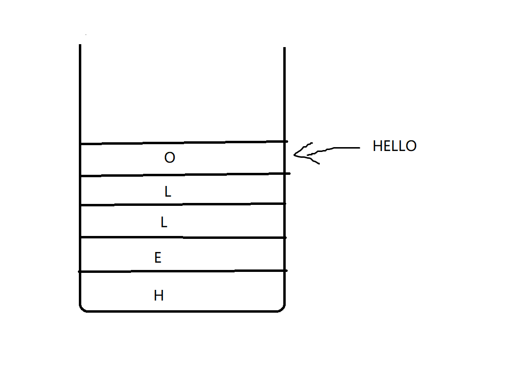
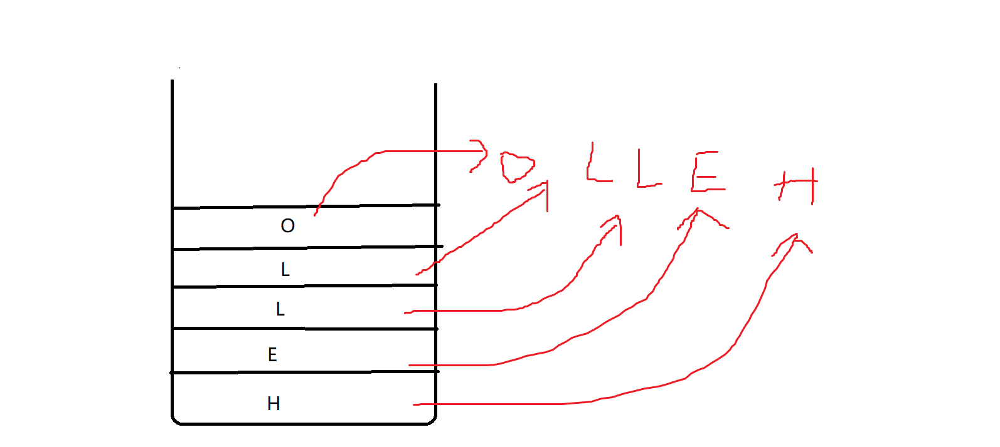

# 栈

# 用数组实现栈

```cpp
#include <iostream>
using namespace std;

int MAX_SIZE = 10;              // 定义栈的最大容量
int *Stack = new int[MAX_SIZE]; // 动态分配数组空间
int top = -1;                   // 栈顶指针初始化为-1

void push_back(int n)
{ // 入栈操作
    if (top == MAX_SIZE - 1)
    { // 如果栈已满，扩容两倍
        MAX_SIZE = 2 * MAX_SIZE;
        int *newStack = new int[MAX_SIZE]; // 动态分配更大的数组空间
        for (int i = 0; i <= top; i++)
        { // 将原数组中的元素复制到新数组中
            newStack[i] = Stack[i];
        }
        Stack = newStack; // 将指针指向新数组的首地址
    }
    top = top + 1;  // 栈顶指针加1
    Stack[top] = n; // 将元素压入栈顶
}

void pop()
{                  // 出栈操作
    top = top - 1; // 栈顶指针减1
}

bool IsEmpty()
{ // 判断栈是否为空
    if (top == -1)
    { // 栈顶指针为-1时，栈为空
        return true;
    }
    return false;
}

int top_element()
{ // 返回栈顶元素
    return Stack[top];
}

int search(int n)
{ // 查找元素在栈中的位置
    for (int i = 0; i <= top; i++)
    { // 从栈底开始遍历栈中的所有元素
        if (Stack[i] == n)
        {             // 如果找到指定的元素
            return i; // 返回元素在栈中的位置
        }
    }
    return -1; // 否则返回-1
}

int main(void)
{
    // 测试代码
    for (int i = 0; i < 200; i++)
    { // 入栈200个元素
        push_back(i);
    }
    while (!IsEmpty())
    { // 出栈并输出元素
        cout << top_element() << " ";
        pop();
    }
    cout << search(3) << endl; // 查找元素3在栈中的位置
    delete[] Stack;            // 释放动态分配的数组空间
    return 0;
}
```

为了更加清晰明了，我写了下面的程序，实现了和上面一样的功能
`stack_array_v2.cpp`
```cpp
#include <iostream>
using namespace std;
class Stack
{
private:
    int MAX_SIZE = 10;              // 定义栈的最大容量
    int *Stack = new int[MAX_SIZE]; // 动态分配数组空间
    int top = -1;

public:
    void push_back(int val)
    {
        if (top >= MAX_SIZE - 1)
        {
            MAX_SIZE *= 2;
            int *newStack = new int[MAX_SIZE];
            for (int i = 0; i <= top; i++)
            {
                newStack[i] = Stack[i];
            }
            Stack = newStack;
        }
        top++;
        Stack[top] = val;
    }
    void pop()
    {
        top--;
    }
    bool is_empty()
    {
        return top == -1; // 判断栈是否为空
    }
    int top_element()
    {
        return Stack[top];
    }
    int search(int n)
    { // 查找元素在栈中的位置
        for (int i = 0; i <= top; i++)
        { // 从栈底开始遍历栈中的所有元素
            if (Stack[i] == n)
            {             // 如果找到指定的元素
                return i; // 返回元素在栈中的位置
            }
        }
        return -1; // 否则返回-1
    }
};
int main(void)
{
    Stack s;
    for (int i = 0; i <= 200; i++)
    {
        s.push_back(i);
    }
    while (!s.is_empty())
    {
        cout << s.top_element() << " ";
        s.pop();
    }
    
    return 0;
}
```

# 用链表实现栈
```cpp
#include <iostream>
struct Node {
    int data;
    Node *next;
};
class Stack {
private:
    Node *top;
public:
    Stack() {
        top = nullptr;
    }
    void push(int val) {
        Node *node = new Node();
        node->data = val;
        node->next = top;
        top = node;
    }
    void pop() {
        if(top != nullptr) {
            Node *node = top;
            top = top->next;
            delete node;
        }
    }
    int topVal() {
        if(top != nullptr) {
            return top->data;
        }else {
            return -1;
        }
    }
    bool isEmpty() {
        return top == nullptr;
    }
};
int main(void) {
    Stack s;
    for(int i = 0; i < 200; i++) {
        s.push(i);
    }
    while(!s.isEmpty()) {
        std::cout << s.topVal() << std::endl;
        s.pop();
    }
}
```


# 翻转一个字符串或者翻转一个链表(用栈实现)

## Reverse a string in default

例如： 

hello -> olleh

### 翻转字符串的常规做法

```cpp
#include <iostream>
#include <string>
using namespace std;
void reverse_string(string &s) {
    int len = s.length();
    for (int i = 0; i < len / 2; i++) {
        char temp = s[i];
        s[i] = s[len - i - 1];
        s[len - i - 1] = temp;
    }
}
int main(void) {
    string s = "hello";
    cout << "The valine of s is: " << s << endl;
    reverse_string(s);
    cout << "The reverse result of s is: " << s << endl;
    return 0;
}
```

```cpp
#include <iostream>
#include <string>
#include <algorithm>
using namespace std;
int main(void) {
    string s = "hello";
    cout << "The valine string value is: " << s << endl; 
    s.reverse(s.begin(),s.end());
    cout << "The reverse string value is: "<< s << endl;
    return 0;
}

```
## Reverse a string using Stack
我们首先把HELLO这个字符串一个字符一个字符的放入栈中


然后让栈里面的字符从栈顶依次出栈就行了！




下面是代码实现

```cpp
#include <iostream>
#include <string>
using namespace std;
class Stack
{
private:
    int MAX_SIZE = 5;
    char *stack = new char[MAX_SIZE];
    int top = -1;

public:
    void push_back(char n)
    {
        if (top == MAX_SIZE - 1)
        {
            MAX_SIZE *= 2;
            char *newStack = new char[MAX_SIZE];
            for (int i = 0; i <= top; i++)
            {
                newStack[i] = stack[i];
            }
            stack = newStack;
        }
        top++;
        stack[top] = n;
    }
    char pop()
    {
        if (top == -1)
        {
            return '\0';
        }
        else
        {
            char temp = stack[top]; // 存储栈顶元素
            top--;                  // 弹出栈顶元素
            return temp;            // 返回被弹出的栈顶元素
        }
    }
};
int main(void)
{
    string s = "hello";
    Stack stack;
        for (char c : s) {
        stack.push_back(c);
    }
    for (int j = 0; j < s.size(); j++)
    {
        cout << stack.pop();
    }
    return 0;
}
```


## Reverse a linklist using Stack

让我们想一想我们之前是怎么翻转链表的？


首先，函数判断链表的头部是否为空或只有一个节点，如果是，则无需进行翻转，直接返回。这一步的判断是非常必要的，因为链表为空或只有一个节点时，翻转链表是没有意义的。

接着，函数定义了三个指针变量 cur、prev、next，它们分别指向当前节点、当前节点的前一个节点和当前节点的后一个节点。其中，cur 变量初始化为链表的头部，prev 变量初始化为 NULL。

进入 while 循环，每次将 next 指向当前节点 cur 的下一个节点，然后将 cur 的 next 指针指向 prev，这样就完成了当前节点的翻转。接着，将 prev 指向当前节点 cur，cur 指向下一个节点 next，继续执行下一轮循环。这样不断地执行，直到 cur 指向链表的最后一个节点，此时整个链表就被翻转了。

最后，将链表的头部指向反转后的链表头部 prev，完成链表的翻转操作。

综上所述，您的 Reverse() 函数采用了迭代的方式翻转链表，通过遍历链表，每次将当前节点的 next 指针指向前一个节点，最终完成整个链表的翻转。

```cpp
#include <iostream>
using namespace std;
struct Node
{
    int data;
    Node *next;
};
Node *head;
void Insert(int num);
void Print();
void Reverse();
int main(void)
{
    head = NULL;
    Insert(1);
    Insert(2);
    Insert(3);
    Insert(4);
    Insert(5);
    Insert(6);
    Print();
    cout << "Now we will reverse this linklist!" << endl;
    Reverse();
    Print();
}
void Insert(int num)
{
    Node *temp = new Node();
    temp->data = num;
    temp->next = NULL;
    if (head == NULL)
    {
        head = temp;
    }
    else
    {
        Node *cur = head;
        while (cur->next != NULL)
        {
            cur = cur->next;
        }
        cur->next = temp;
    }
}
void Print()
{
    cout << "The content in linklist:" << endl;
    Node *cur = head;
    while (cur != NULL)
    {
        cout << cur->data << " ";
        cur = cur->next;
    }
    cout << endl;
}
void Reverse()
{
    if (head == NULL || head->next == NULL)
    {
        cout << "元素数量不足，无法进行翻转!" << endl;
        return;
    }
    Node *cur,*prev,*next;
    cur = head;
    prev = NULL;
    while (cur != NULL)
    {
        next = cur->next;
        cur->next = prev;
        prev = cur;
        cur = next;
    }
    head = prev;
}
```


> 那该如何用栈来翻转链表呢？
>
> 使用栈可以将链表翻转为逆序，具体步骤如下：
>
> 1. 遍历链表，将每个节点的指针依次压入栈中。
> 2. 弹出栈顶元素，将其指针指向下一个栈顶元素，直到栈为空。
> 3. 返回链表的新头节点。


```cpp
#include <iostream>
#include <stack>
using namespace std;

// 链表节点结构体
struct Node
{
    int data;       // 数据
    Node *next;     // 指向下一个节点的指针
};

// 链表类
class LinkList
{
public:
    Node *head = nullptr;   // 链表的头节点

    // 在链表末尾插入一个节点
    void Insert(int val)
    {
        Node *temp = new Node();    // 创建新节点
        temp->data = val;           // 设置新节点的数据
        temp->next = nullptr;       // 新节点的下一个节点指针为nullptr

        if (head == nullptr)        // 如果链表为空
        {
            head = temp;            // 将新节点设置为头节点
            return;
        }
        else                        // 如果链表不为空
        {
            Node *cur = head;
            while (cur->next != nullptr)    // 遍历链表找到最后一个节点
            {
                cur = cur->next;
            }
            cur->next = temp;       // 将新节点连接到最后一个节点的后面
        }
    }

    // 打印链表中的所有元素
    void Print()
    {
        Node *cur = head;
        while (cur != nullptr)
        {
            cout << cur->data << " ";
            cur = cur->next;
        }
    }

    // 将链表逆序
    void Reverse()
    {
        stack<Node *> s;   // 创建一个栈，用来存储链表中的所有节点

        Node *cur = head;
        while (cur != nullptr)      // 将链表中的所有节点都压入栈中
        {
            s.push(cur);
            cur = cur->next;
        }

        head = s.top();     // 将栈顶元素设置为链表的新头节点
        s.pop();

        cur = head;         // 遍历链表，将栈中的节点依次弹出并连接起来
        while (!s.empty())
        {
            cur->next = s.top();
            s.pop();
            cur = cur->next;
        }
        cur->next = nullptr;    // 最后一个节点的下一个节点指针为nullptr
    }
};

int main(void)
{
    LinkList l;     // 创建一个链表对象

    // 向链表中插入元素
    l.Insert(1);
    l.Insert(2);
    l.Insert(3);
    l.Insert(4);
    l.Insert(5);
    l.Insert(6);
    l.Insert(7);

    // 打印原始链表
    l.Print();
    cout << endl;

    // 将链表逆序
    l.Reverse();

    // 打印逆序后的链表
    l.Print();
    cout << endl;

    return 0;
}
```

# 用栈检查括号是否匹配
```cpp
#include <iostream>
#include <stack>
#include <string>

// 括号匹配函数
bool paren(const std::string &input)
{
    std::stack<char> s;
    for (const char c : input)
    {
        // 左括号入栈
        if (c == '(' || c == '[' || c == '{')
        {
            s.push(c);
            continue;
        }
        // 右括号匹配
        if (s.empty() ||
            (c == ')' && s.top() != '(') ||
            (c == '}' && s.top() != '{') ||
            (c == ']' && s.top() != '['))
        {
            return false;
        }

        // 匹配成功，弹出左括号
        s.pop();
    }
    // 判断栈是否为空
    return s.empty();
}

int main()
{
    const std::string input1 = "({[]})";
    const std::string input2 = "({[})";
    std::cout << std::boolalpha << paren(input1) << '\n';
    std::cout << std::boolalpha << paren(input2) << '\n';
    /*
    std::boolalpha 是一个 std::ios 标志，用于指示流输出布尔值时使用文字形式输出，即将 true 输出为 "true"，将 false 输出为 "false"。

    默认情况下，流输出布尔值时使用整数形式输出，即将 true 输出为 1，将 false 输出为 0。如果需要输出文字形式，可以使用 std::boolalpha 标志。

    在代码中，std::cout << std::boolalpha << paren(input1) << '\n'; 表示将 std::boolalpha 标志应用到 std::cout 流上，以确保输出的布尔值使用文字形式。
     */
    return 0;
}
```

这段代码实现了一个括号匹配的函数 paren，用于判断一个由括号组成的字符串中的括号是否匹配。

函数 paren 接受一个字符串 input 作为输入，使用一个栈 s 对每个左括号进行入栈操作，并在遇到右括号时进行匹配操作。具体来说，当遇到左括号时，将其压入栈中；当遇到右括号时，判断栈顶元素是否与该右括号匹配，如果匹配则弹出栈顶元素，否则返回 false。

在函数结束时，判断栈是否为空，如果为空则返回 true，否则返回 false。

在 main 函数中，声明了两个字符串 input1 和 input2，分别为 "({[]})" 和 "({[})"。然后分别调用 paren 函数，并将返回值输出到标准输出流中。

std::boolalpha 标志用于指示流输出布尔值时使用文字形式输出，即将 true 输出为 "true"，将 false 输出为 "false"。这样可以使输出更加直观。

最后返回 0，表示程序正常退出。

# 什么是前缀，中缀，后缀
https://zhuanlan.zhihu.com/p/37467928

学习这里建议看三哥得课
https://www.bilibili.com/video/BV1Fv4y1f7T1?p=21&spm_id_from=pageDriver&vd_source=f7d0ce024b059d57a0319d78217fa104

**19-22**就是讲这些得，其中有伪代码


中缀表达式转后缀表达式：
> GPT写的
```cpp
#include <iostream>
#include <stack>
#include <unordered_map>
#include <vector>
#include <sstream>
#include <algorithm>

bool isOperator(const std::string& token)
{
    static const std::unordered_map<std::string, int> operators = {
        {"+", 1},
        {"-", 1},
        {"*", 2},
        {"/", 2},
        {"%", 2},
        {"^", 3}
    };
    return operators.count(token) > 0;
}

bool isOperand(const std::string& token)
{
    return !isOperator(token) && token != "(" && token != ")";
}

int precedence(const std::string& op)
{
    static const std::unordered_map<std::string, int> operators = {
        {"+", 1},
        {"-", 1},
        {"*", 2},
        {"/", 2},
        {"%", 2},
        {"^", 3}
    };
    return operators.at(op);
}

std::vector<std::string> infixToPostfix(const std::vector<std::string>& infix)
{
    std::stack<std::string> s;
    std::vector<std::string> postfix;

    for (const auto& token : infix) {
        if (isOperand(token)) {
            postfix.push_back(token);
        } else if (token == "(") {
            s.push(token);
        } else if (token == ")") {
            while (!s.empty() && s.top() != "(") {
                postfix.push_back(s.top());
                s.pop();
            }
            if (s.empty()) {
                throw std::runtime_error("Unmatched parenthesis");
            }
            s.pop();
        } else if (isOperator(token)) {
            while (!s.empty() && s.top() != "(" && precedence(token) <= precedence(s.top())) {
                postfix.push_back(s.top());
                s.pop();
            }
            s.push(token);
        }
    }

    while (!s.empty()) {
        if (s.top() == "(") {
            throw std::runtime_error("Unmatched parenthesis");
        }
        postfix.push_back(s.top());
        s.pop();
    }

    return postfix;
}

int main()
{
    std::string input;
    std::getline(std::cin, input);

    std::vector<std::string> tokens;
    std::istringstream iss(input);
    std::string token;
    while (iss >> token) {
        tokens.push_back(token);
    }

    const auto postfix = infixToPostfix(tokens);

    for (const auto& token : postfix) {
        std::cout << token << " ";
    }
    std::cout << std::endl;

    return 0;
}

/* 
3 + 4 * 2 / ( 1 - 5 ) ^ 2 ^ 3
3 4 2 * 1 5 - 2 ^ 3 ^ / +
 */

```

在这个程序中，我们定义了以下几个函数：

isOperator：判断一个字符串是否为运算符。
isOperand：判断一个字符串是否为操作数。
precedence：获取一个运算符的优先级。
infixToPostfix：将一个中缀表达式转换为后缀表达式。
在 infixToPostfix 函数中，我们使用一个栈 s 和一个输出序列 postfix。我们从左到右遍历输入的中缀表达式，对于每个操作数，直接将其添加到输出序列中；对于每个运算符，我们从栈中弹出优先级比它高或相等的运算符，并将它们添加到输出序列中，然后将当前运算符入栈。对于左括号，直接入栈；对于右括号，我们从栈中弹出运算符，直到遇到左括号，并将弹出的运算符添加到输出序列中。在遍历完成后，我们将栈中所有剩余的运算符依次弹出，并将它们添加到输出序列中。

最后，我们按照正序遍历输出序列，即得到了转换后的后缀表达式。

注意，这个程序还考虑了一些错误处理。如果括号不匹配，程序将抛出一个 std::runtime_error 异常。


