# 树

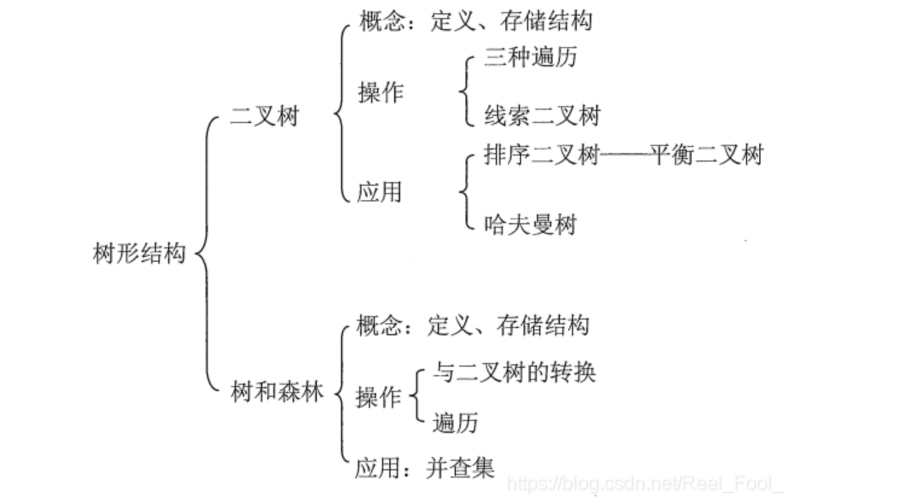

树就像下面这样连接

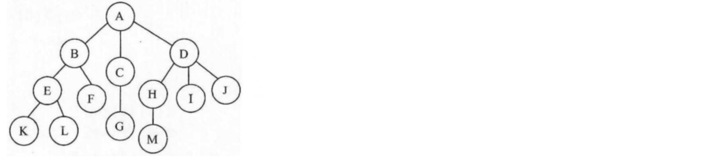

## 树的一些概念

参考了：https://itbaima.net/document

**根结点**：我们一般称最上方的节点是树的根结点

**子节点，父节点**：与当前结点直接向下相连的结点，我们称为子结点（Child），比如B、C、D结点，都是A的子结点，就像族谱中的父子关系一样，下一代一定是子女，相反的，那么A就是B、C、D的父结点（Parent），也可以叫双亲结点。

**度**：每个结点连接的子结点的数目，各个结点度的最大值称为树的度

**子树**：每个结点延伸下去的下一个节点都可以称为一颗子树

**层次**：每个结点的层次（Level）按照从上往下的顺序，树的根结点为1，每向下一层+1，比如G的层次就是3

**深度**：整棵树中所有结点的最大层次，就是这颗树的深度（Depth），比如上面这棵树的深度为4，因为最大层次就是4。

**叶子结点**： 某个节点没有任何的子结点（结点度为0时），就是叶子结点

**兄弟结点**：果两个结点的父结点是同一个，那么称这两个节点为兄弟结点（Sibling）比如B和C就是兄弟结点，因为都是A的孩子

**祖先结点**：从根结点开始一直到某个结点的整条路径的所有结点，都是这个结点的祖先结点（Ancestor）比如L的祖先结点就是A、B、E

## 二叉树（Binary Tree)

每个结点最多有两个子结点的树叫做二叉树
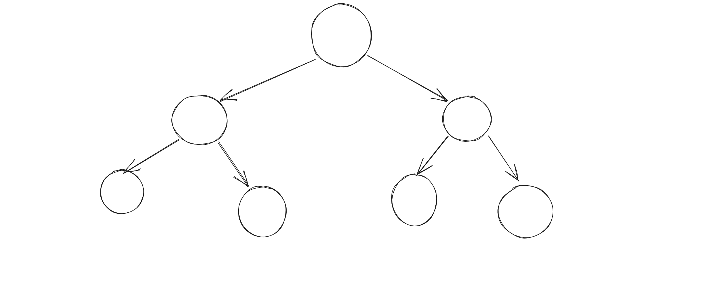
如图，这是一棵标准的二叉树
并且二叉树任何结点的子树是有左右之分的，不能颠倒顺序

二叉树有5种基本形态，分别是：
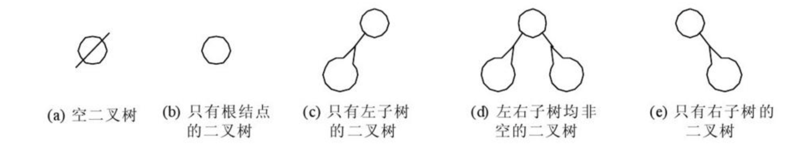

### 满二叉树

> 概念：在一棵二叉树中，所有分支结点都存在左子树和右子树，且叶子结点都在同一层

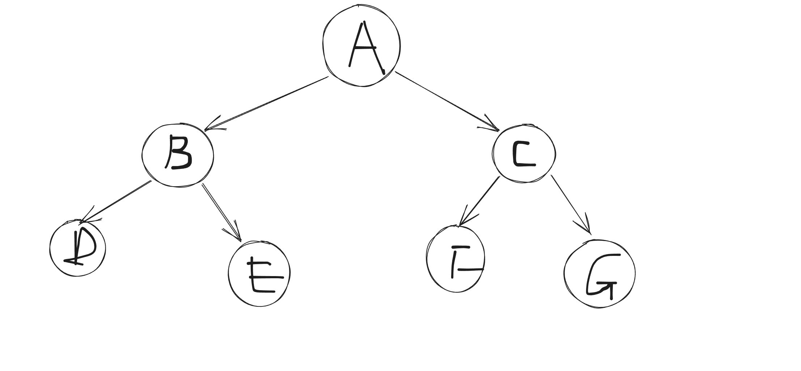

### 完全二叉树

> 最后一层有空缺，并且所有的叶子结点是按照从左往右的顺序排列的，这样的二叉树我们一般称其为完全二叉树，所以，一棵满二叉树，一定是一棵完全二叉树。

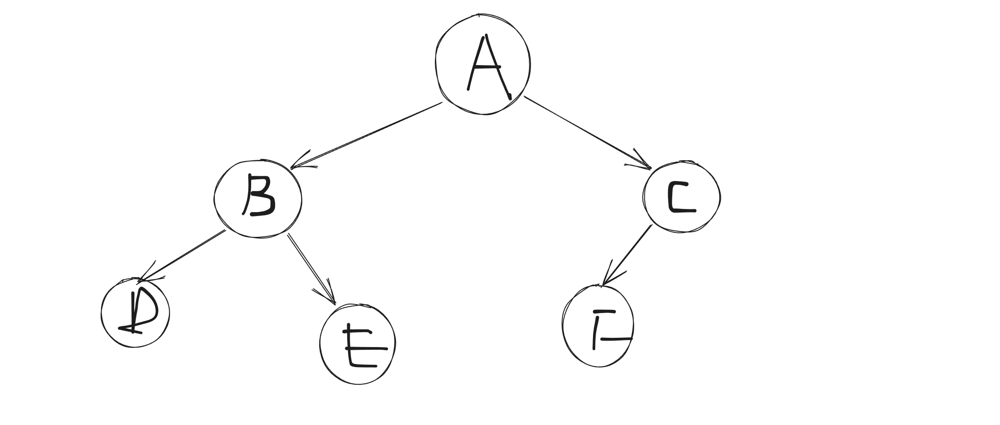

### 斜树

所有的结点都只有左子树的二叉树叫左斜树。所有结点都是只有右子树的二叉树叫右斜树。这两者统称为斜树。

### 二叉树的性质

对于一棵深度为k的二叉树，可以具有的最大结点数量为：


## 二叉搜索树

二叉搜索树 (BST) 是遵循特定排序属性的二叉树数据结构。在 BST 中，每个节点最多有两个子节点，通常称为“左”子节点和“右”子节点。 BST 属性确保对于树中的每个节点：
当前节点左子树中的所有节点的值都小于当前节点的值。
当前节点右子树中的所有节点的值都大于当前节点的值。
BST 属性允许高效的搜索、插入和删除操作。二叉搜索树的排序属性创建了一个层次结构，有助于快速定位具有特定值的节点。
例如，考虑以下二叉搜索树：

```
       5
     /   \
    3     8
   / \   / \
  2   4 6   9

```

在此 BST 中：
根节点的值为 5。
根的左子树（节点 3、2 和 4）包含小于 5 的值。
根的右子树（节点 8、6 和 9）包含大于 5 的值。
要在 BST 中执行搜索，您需要将要查找的值与当前节点的值进行比较，并根据比较结果递归地向左或向右导航，直到找到目标节点或确定它不存在于树中。
BST 中的插入涉及根据 BST 属性找到新节点的正确位置，并将其作为叶节点添加到适当的位置。
BST 中的删除有点复杂，因为它需要在删除节点时维护 BST 属性。根据要删除的节点，可能涉及重新组织树或用其有序后继或前驱替换该节点。
BST 因其高效的搜索、插入和删除操作而广泛应用于计算机科学中。它们通常应用于各种算法和数据结构中，例如AVL树和红黑树等平衡搜索树，可确保更平衡和可预测的树结构，以防止极端情况下的性能下降。

### 实现二叉搜索树

我们首先要实现的是Insert函数
实现二叉搜索树 (BST) 的插入功能涉及在正确位置添加具有给定值的新节点，同时维护 BST 属性。以下是有关如何解决此问题的分步指南：

1. 了解 BST 属性：在实现插入功能之前，请确保您了解 BST 属性，即左子树中的所有节点的值都小于当前节点，右子树中的所有节点的值都大于当前节点。
2. 从根开始：要将新值插入 BST，通常从根节点开始，根据当前节点的值和要插入的值向下遍历树。
3. 遍历树：将要插入的值与当前节点的值进行比较。如果该值小于当前节点的值，则移动到左子树并重复该过程。如果该值大于当前节点的值，则移动到右子树并重复该过程。继续此过程，直到到达可以插入新节点的位置。
4. 插入新节点：当找到插入新节点的位置（即到达叶节点或空子节点指针）时，使用给定值创建一个新节点，并将其放置为当前节点的左子节点或右子节点，具体取决于值比较。

```cpp
#include <iostream>
template <typename T>
struct Node
{
    T data;
    Node<T> *left;
    Node<T> *right;
    Node(T value) : data(value), left(nullptr), right(nullptr) {}
};

template <typename T>
class BinaryTree
{
private:
    Node<T> *root;

public:
    BinaryTree() : root(nullptr){};

    void insert(T value)
    {
        root = insertRecursive(root, value);
    }

    Node<T> *insertRecursive(Node<T> *node, T value)
    {
        if (node == nullptr)
        {
            return new Node<T>(value);
        }
        if (value < node->data)
        {
            node->left = insertRecursive(node->left, value);
        }
        else if (value > node->data)
        {
            node->right = insertRecursive(node->right, value);
        }
        return node;
    }
};

```

现在我们已经写好基本的程序了，那么怎么看我们插入的怎么样呢？
我们可以写一个返回根结点的方法

```cpp
    Node<T>* getRoot() {
        return root;
    }
```

把它加到咱们的BinaryTree类里面
然后我们在main函数里面开始操作

```cpp

#include <iostream>
template <typename T>
struct Node
{
    T data;
    Node<T> *left;
    Node<T> *right;
    Node(T value) : data(value), left(nullptr), right(nullptr) {}
};

template <typename T>
class BinaryTree
{
private:
    Node<T> *root;

public:
    BinaryTree() : root(nullptr){};
    Node<T> *getRoot()
    {
        return root;
    }
    void insert(T value)
    {
        root = insertRecursive(root, value);
    }

    Node<T> *insertRecursive(Node<T> *node, T value)
    {
        if (node == nullptr)
        {
            return new Node<T>(value);
        }
        if (value < node->data)
        {
            node->left = insertRecursive(node->left, value);
        }
        else if (value > node->data)
        {
            node->right = insertRecursive(node->right, value);
        }
        return node;
    }
};

int main(void)
{
    BinaryTree<int> binaryTree;
    binaryTree.insert(1); // 第一个插入的结点是根节点
    binaryTree.insert(0); // 小于根节点，在根节点左侧
    binaryTree.insert(2); // 大于根结点,在根节点右侧
    binaryTree.insert(3); //大于根结点，在根节点右侧，又大于2，在2结点的右侧
    Node<int> *root = binaryTree.getRoot();
    std::cout << root->left->data << std::endl;
    std::cout << root->right->data << std::endl;
    std::cout << root->right->right->data << std::endl;
}
```

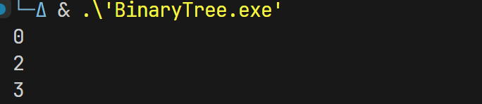

### 二叉搜索树查找最大最小值
[findMinMaxByBST.cpp](../src/findMinMaxByBST.cpp)
根据二叉搜索树的性质，我们知道，一直走左子树，就是最小值，一直走右子树，就是最大值

```cpp
#include <iostream>
template <typename T>
struct Node
{
    T data;
    Node<T> *left;
    Node<T> *right;
    Node(T value) : data(value), left(nullptr), right(nullptr) {}
};

template <typename T>
class BinarySearchTree
{
private:
    Node<T> *root;
    Node<T> *insertRecursive(Node<T> *node, T value)
    {
        if (node == nullptr)
        {
            return new Node<T>(value);
        }
        if (value < node->data)
        {
            node->left = insertRecursive(node->left, value);
        }
        else if (value > node->data)
        {
            node->right = insertRecursive(node->right, value);
        }
        return node;
    }

public:
    BinarySearchTree() : root(nullptr){};
    Node<T> *getRoot()
    {
        return root;
    }
    void Insert(T value)
    {
        root = insertRecursive(root, value);
    }

    Node<T> *findMin()
    {
        Node<T> *current = root;
        while (current->left != nullptr)
        {
            current = current->left;
        }
        return current;
    }
    Node<T> *findMax()
    {
        Node<T> *current = root;
        while (current->right != nullptr)
        {
            current = current->right;
        }
        return current;
    }
};
int main(void)
{
    BinarySearchTree<int> bst;
    bst.Insert(1);
    bst.Insert(2);
    bst.Insert(0);
    bst.Insert(-1);
    bst.Insert(4);
    bst.Insert(3);
    std::cout << "bst.findMax() = " << bst.findMax()->data << std::endl;
    std::cout << "bst.findMin() = " << bst.findMin()->data << std::endl;
    return 0;
}
```

### 获得二叉搜索树的最大深度
[findHeightOfBST.cpp](../src/findHeightOfBST.cpp)
树的深度：树从根结点开始往下数，叶子结点所在的最大层数称为树的深度。

代码：
```cpp
#include <iostream>
struct Node
{
    int data;
    Node *left;
    Node *right;
    Node(int value) : data(value), left(nullptr), right(nullptr) {}
};
class Tree
{
private:
    Node *root;
    Node *insertRecursive(Node *node, int value)
    {
        if (node == nullptr)
        {
            return new Node(value);
        }
        if (value < node->data)
        {
            node->left = insertRecursive(node->left, value);
        }
        else if (value > node->data)
        {
            node->right = insertRecursive(node->right, value);
        }
        return node;
    }

public:
    Tree() : root(nullptr){};
    Node *getRoot()
    {
        return root;
    }
    void insert(int value)
    {
        root = insertRecursive(root, value);
    }
    int getHeight(Node *node)
    {
        if (node == nullptr)
        {
            return -1;
        }
        return 1 + std::max(getHeight(node->left), getHeight(node->right));
    }
};

int main(void)
{
    Tree bst;
    bst.insert(1);
    bst.insert(3);
    bst.insert(2);
    bst.insert(4);
    bst.insert(0);
    bst.insert(-1);
    bst.insert(-2);
    std::cout << "bst.getHeight(bst.getRoot()):" << bst.getHeight(bst.getRoot()) << std::endl;
    return 0;
}
```
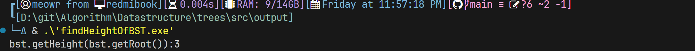
下面是这个二叉树的展示图，很明显，它的最大深度(高度)是3
```plaintext
          1
         / \
        0   3
       /   / \
     -1   2   4
          \
          -2

```

让我们逐步分析一下getHeight()函数的递归过程，以及为什么最终能够得到二叉树的最大深度。

首先，让我们考虑递归的基本情况（递归出口）：

如果传入的节点指针node为空指针（即nullptr），表示当前子树为空，因此深度为-1（空树深度为0）。
在这种情况下，getHeight()函数会返回-1。
接下来，如果节点指针node不为空，那么递归过程如下：

首先，分别对左子树和右子树调用getHeight()函数，以获取它们的深度。
通过递归，getHeight()会依次向下遍历左右子树，并计算出它们的深度。
在返回阶段，递归函数会比较左右子树的深度，然后取两者中的较大值，并加上当前节点的深度（1），表示当前子树的深度。

这是因为二叉树的深度由根节点开始往下逐层累加得到，每往下一层深度加1。
最后，递归返回的过程中，层层向上计算，直到返回到根节点为止。

现在，让我们来分析这个特定的二叉树的构建和高度计算：

```plaintext
          1
         / \
        0   3
       /   / \
     -1   2   4
          \
          -2

```

接下来，调用getHeight(bst.getRoot())，其中bst.getRoot()返回根节点1。

getHeight(1)调用：

不为空，进入递归。
计算左子树的高度：getHeight(0)。
计算右子树的高度：getHeight(3)


getHeight(0)调用：
不为空，进入递归。
左子树不为空，返回getHeight(-1)。
getHeight(-1)调用：
不为空，进入递归
左右子树都为空，返回0
右子树为空，返回-1。
返回1 + max(0, -1)，即1。


getHeight(3)调用：
不为空，进入递归。
计算左子树的高度：getHeight(2)。
计算右子树的高度：getHeight(4)。

getHeight(2)调用：
不为空，进入递归。
左子树为空，返回-1。
计算右子树的高度：getHeight(-2)。
getHeight(-2)调用：
不为空，进入递归。
左子树为空，返回-1。
右子树为空，返回-1。
getHeight(-2)返回1 + max(-1, -1)，即0。
getHeight(2) 返回 1 + max(0,-1) = 1 


getHeight(4)调用：
不为空，进入递归。
左子树为空，返回-1。
右子树为空，返回-1。
返回1 + max(-1, -1)，即0。

回到getHeight(3)调用，得到左子树高度为0，右子树高度为0。
返回1 + max(1, 0)，即2。
回到getHeight(1)调用，得到左子树高度为2，右子树高度为2。

返回1 + max(1, 2)，即3。
最后，getHeight(bst.getRoot())返回2，即这个二叉树的最大深度为3。

## 三种遍历方式
https://meowrain.cn/archives/er-cha-shu
```plaintext
DLR–前序遍历（根在前，从左往右，一棵树的根永远在左子树前面，左子树又永远在右子树前面 ）

LDR–中序遍历（根在中，从左往右，一棵树的左子树永远在根前面，根永远在右子树前面）

LRD–后序遍历（根在后，从左往右，一棵树的左子树永远在右子树前面，右子树永远在根前面）
```

目前有以前用c写的，下面会用c++重写一次
### 前序遍历(DLR)

**DLR**

[**preOrder.cpp**](../src/preOrderTraversalOfBst.cpp)
```cpp
#include <iostream>
template <typename T>
struct Node
{
    T data;
    Node<T> *left;
    Node<T> *right;
    Node(T value) : data(value), left(nullptr), right(nullptr) {}
};
template <typename T>
class BST
{
private:
    Node<T> *root;
    Node<T> *insertRecursive(Node<T> *node, T value)
    {
        if (node == nullptr)
        {
            return new Node<T>(value);
        }
        if (value < node->data)
        {
            node->left = insertRecursive(node->left, value);
        }
        else if (value > node->data)
        {
            node->right = insertRecursive(node->right, value);
        }
        return node;
    }

public:
    BST() : root(nullptr){};
    Node<T> *getRoot(){return root;};
    void insert(T value)
    {
        root = insertRecursive(root, value);
    }
    void PreOrder(Node<T> *node)
    {
        if (node == nullptr)
        {
            return;
        }
        std::cout << node->data << " ";
        PreOrder(node->left);
        PreOrder(node->right);
    }
};
int main(void) {
    BST<int> bst;
    bst.insert(4);
    bst.insert(2);
    bst.insert(1);
    bst.insert(3);
    bst.insert(6);
    bst.insert(5);
    bst.insert(7);
    bst.PreOrder(bst.getRoot());
}
```
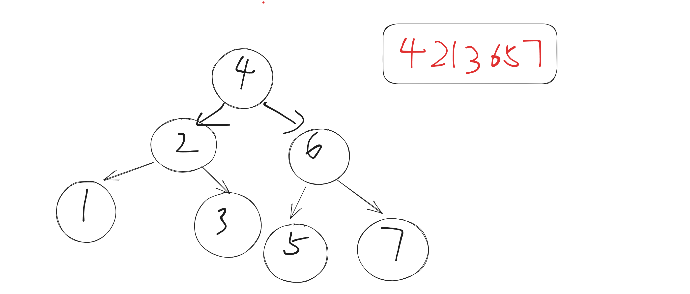
### 中序遍历(LDR)

**LDR**

[inOrder.cpp](../src/inOrderTraversalOfBst.cpp)
```cpp
/* 中序遍历 */
#include <iostream>
template <typename T>
struct Node
{
    T data;
    Node<T> *left;
    Node<T> *right;
    Node(T value) : data(value), left(nullptr), right(nullptr) {}
};
template <typename T>
class BST
{
private:
    Node<T> *root;
    Node<T> *insertRecursive(Node<T> *node, T value)
    {
        if (node == nullptr)
        {
            return new Node<T>(value);
        }
        if (value < node->data)
        {
            node->left = insertRecursive(node->left, value);
        }
        else if (value > node->data)
        {
            node->right = insertRecursive(node->right, value);
        }
        return node;
    }

public:
    BST() : root(nullptr){};
    Node<T> *getRoot() { return root; };
    void insert(T value)
    {
        root = insertRecursive(root, value);
    }
    void inOrder(Node<T> *node)
    {
        if (node == nullptr)
        {
            return;
        }
        inOrder(node->left);
        std::cout << node->data << " ";
        inOrder(node->right);
    }
};
int main(void)
{
    BST<int> bst;
    bst.insert(4);
    bst.insert(2);
    bst.insert(1);
    bst.insert(3);
    bst.insert(6);
    bst.insert(5);
    bst.insert(7);
    bst.inOrder(bst.getRoot());
}
```
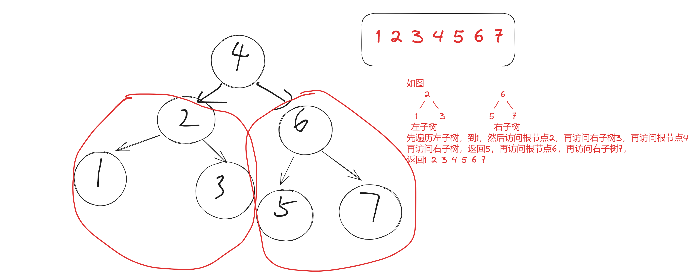
### 后序遍历(LRD)
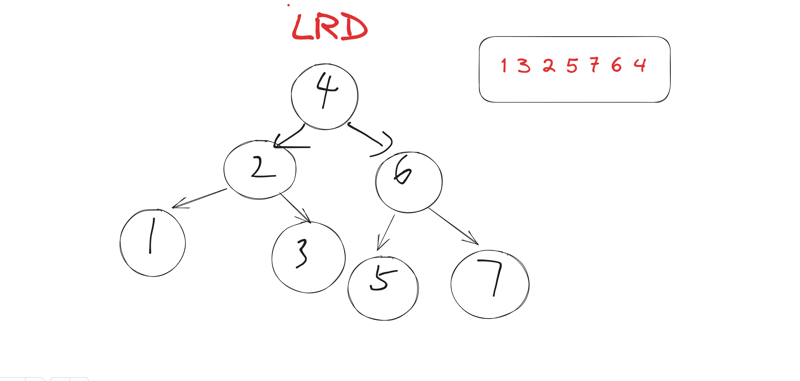
```cpp
/* 后序遍历 */
#include <iostream>
template <typename T>
struct Node
{
    T data;
    Node<T> *left;
    Node<T> *right;
    Node(T value) : data(value), left(nullptr), right(nullptr) {}
};
template <typename T>
class BST
{
private:
    Node<T> *root;
    Node<T> *insertRecursive(Node<T> *node, T value)
    {
        if (node == nullptr)
        {
            return new Node<T>(value);
        }
        if (value < node->data)
        {
            node->left = insertRecursive(node->left, value);
        }
        else if (value > node->data)
        {
            node->right = insertRecursive(node->right, value);
        }
        return node;
    }

public:
    BST() : root(nullptr){};
    Node<T> *getRoot() { return root; };
    void insert(T value)
    {
        root = insertRecursive(root, value);
    }
    void postOrder(Node<T> *node)
    {
        if (node == nullptr)
        {
            return;
        }
        postOrder(node->left);
        postOrder(node->right);
        std::cout << node->data << " ";

    }
};
int main(void)
{
    BST<int> bst;
    bst.insert(4);
    bst.insert(2);
    bst.insert(1);
    bst.insert(3);
    bst.insert(6);
    bst.insert(5);
    bst.insert(7);
    bst.postOrder(bst.getRoot());
    return 0;
}
```

### 层序遍历
因为要使用队列实现，所以写了[MyQueue.cpp](../src/MyQueue.cpp)和[MyQueue.h](../src/MyQueue.h)
下面是levelOrderTraversalOfBst.cpp得实现
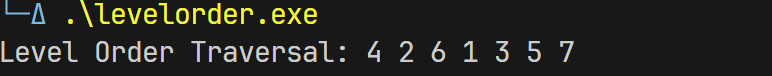
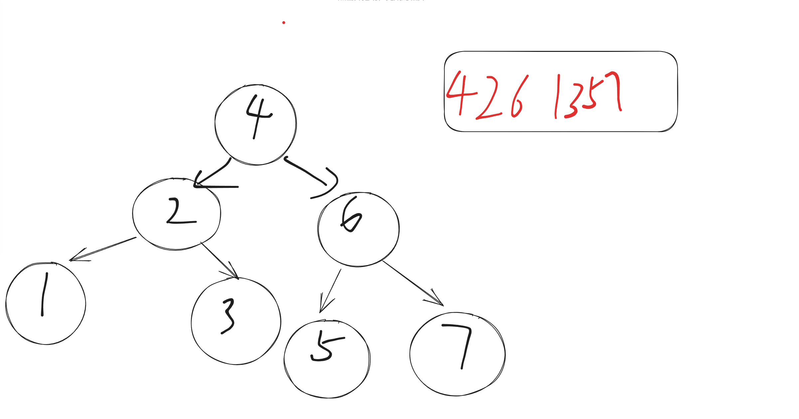
```cpp
#include <iostream>
#include "MyQueue.h"

class BinarySearchTree
{
private:
    Node *root;

    // Helper function for inserting a value into the binary search tree
    Node* insertHelper(Node *current, int value)
    {
        if (current == nullptr)
        {
            return new Node(value);
        }

        if (value < current->data)
        {
            current->left = insertHelper(current->left, value);
        }
        else if (value > current->data)
        {
            current->right = insertHelper(current->right, value);
        }

        return current;
    }

public:
    BinarySearchTree() : root(nullptr) {}

    void insert(int value)
    {
        root = insertHelper(root, value);
    }

    void levelOrderTraversal()
    {
        if (root == nullptr)
        {
            return;
        }

        MyQueue queue;
        queue.push(root);

        while (!queue.empty())
        {
            Node *current = queue.front();
            std::cout << current->data << " ";

            if (current->left)
            {
                queue.push(current->left);
            }

            if (current->right)
            {
                queue.push(current->right);
            }

            queue.pop();
        }
    }
};

int main()
{
    BinarySearchTree bst;

    // 插入节点构建二叉搜索树
    bst.insert(4);
    bst.insert(2);
    bst.insert(1);
    bst.insert(3);
    bst.insert(6);
    bst.insert(5);
    bst.insert(7);

    // 层序遍历并输出结果
    std::cout << "Level Order Traversal: ";
    bst.levelOrderTraversal();
    std::cout << std::endl;

    return 0;
}

```

## 广度优先搜索和深度优先搜素(BFS&DFS)
> 在介绍BFS和DFS之前，容许我先来讲讲什么是前序遍历，中序遍历，后序遍历，层序遍历，

### BFS
这是一个 BST 的示例：
```plaintext
         8
       /   \
      3     10
     / \      \
    1   6     14
       / \    /
      4   7  13

```
现在，让我们逐步执行 BFS 在这个 BST 上：

第 1 步：

将根节点（8）入队列：[8]
出队列队首节点（8），处理它，并将其左右子节点入队列：队列 [3, 10]
第 2 步：

出队列队首节点（3），处理它，并将其左右子节点入队列：队列 [10, 1, 6]
第 3 步：

出队列队首节点（10），处理它，并将其右子节点入队列：队列 [1, 6, 14]
第 4 步：

出队列队首节点（1），处理它：队列 [6, 14]
第 5 步：

出队列队首节点（6），处理它，并将其左右子节点入队列：队列 [14, 4, 7]
第 6 步：

出队列队首节点（14），处理它，并将其左子节点入队列：队列 [4, 7, 13]
第 7 步：

出队列队首节点（4），处理它：队列 [7, 13]
第 8 步：

出队列队首节点（7），处理它：队列 [13]
第 9 步：

出队列队首节点（13），处理它：队列 []
这个 BST 的 BFS 遍历顺序是：8, 3, 10, 1, 6, 14, 4, 7, 13

BFS其实就是一种层序遍历，然后通过队列实现,层序遍历我们将在后面介绍到


### DFS